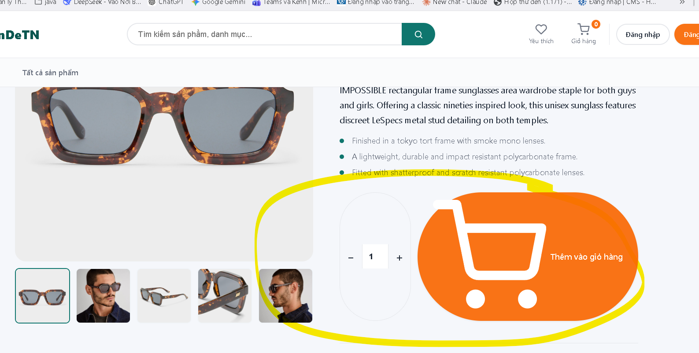
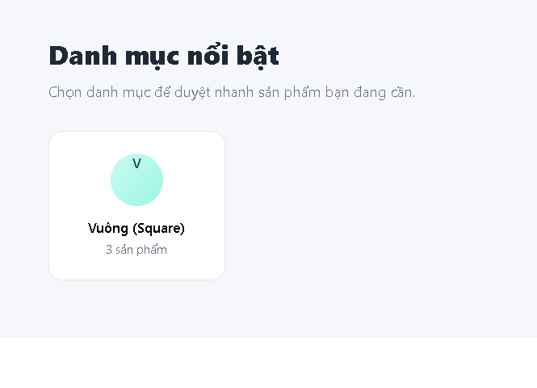

# PROMPT CHO CLAUDE CODE — MÔ-ĐUN THỬ KÍNH ẢO (VIRTUAL TRY-ON)

> Cách dùng: mở Claude Code tại thư mục gốc dự án Django, dán toàn bộ nội dung dưới đây.

---

## 0. Bối cảnh

Tôi đang làm chuyên đề tốt nghiệp: **website thương mại điện tử bán kính mắt (Django + Python + MySQL)** tích hợp 2 mô-đun AI. Bạn sẽ giúp tôi xây dựng **mô-đun 1: Thử kính ảo qua webcam theo thời gian thực**.

Tôi là **sinh viên, chưa có nhiều kinh nghiệm**. Vì vậy:
- Viết code **dễ hiểu**, đặt tên biến rõ nghĩa, có **comment tiếng Việt** giải thích *tại sao* làm vậy (không chỉ *làm gì*).
- Ưu tiên giải pháp **đơn giản, dễ triển khai** hơn giải pháp "xịn" nhưng phức tạp.
- Trước khi viết code, **giải thích cho tôi hiểu** bạn định làm gì và vì sao.
- Nếu tôi yêu cầu điều gì sai kỹ thuật, **hãy nói thẳng** thay vì làm theo.

---

## 1. Yêu cầu bắt buộc từ tài liệu đề cương

Mô-đun phải thực hiện đúng pipeline sau, xử lý **từng khung hình**:

1. **OpenCV** thu khung hình từ webcam.
2. **OpenCV** chuẩn hóa ánh sáng (CLAHE / hiệu chỉnh gamma) để tăng độ ổn định nhận diện khi **thiếu sáng**.
3. **MediaPipe Face Mesh** nhận diện khuôn mặt, trích xuất **facial landmarks** và **ước lượng hướng đầu** (head pose) → xác định vị trí, kích thước, góc nghiêng đặt kính.
4. **OpenCV** biến đổi ảnh kính (xoay, co giãn) và **chồng ảnh kính PNG nền trong suốt** lên khuôn mặt (alpha blending).
5. Hiển thị kết quả lên **trình duyệt web**.

### Hai bài toán kỹ thuật TRỌNG TÂM (giảng viên yêu cầu giải quyết)

**Bài toán A — Khắc phục độ trễ / giật lag:**
Hệ thống chạy real-time qua webcam nên rất dễ chậm, giật. Phải **tối ưu tốc độ xử lý từng khung hình**, đảm bảo hiển thị mượt. Đây là tiêu chí đánh giá chính của đề tài.

**Bài toán B — Xử lý trường hợp đặc biệt (outliers):**
Phải xử lý được khi người dùng: **nghiêng mặt 3/4**, **đeo khẩu trang**, **khuôn mặt bị che khuất một phần**, **thiếu ánh sáng**. Hướng xử lý: dựa trên **độ tin cậy nhận diện** để quyết định hiển thị hay tạm ẩn kính, kèm gợi ý cho người dùng.

> Lưu ý quan trọng: **KHÔNG tự huấn luyện lại mô hình nhận diện khuôn mặt** và không dùng data augmentation để train OpenCV. MediaPipe là mô hình pre-trained đã xử lý tốt các ca này. Nhiệm vụ là *dùng đúng* và *xuống cấp duyên dáng (graceful degradation)* khi vượt giới hạn.

---

## 2. Quy trình làm việc — LÀM TỪNG BƯỚC, KHÔNG NHẢY CÓC

Thực hiện tuần tự. **Sau mỗi giai đoạn, dừng lại báo cáo cho tôi và chờ tôi xác nhận** trước khi sang giai đoạn tiếp theo.

### GIAI ĐOẠN 1 — Nghiên cứu & khảo sát (chưa viết code)

1. Đọc codebase Django hiện tại: cấu trúc app, `settings.py`, `urls.py`, models (đặc biệt `Products`, `ProductImages`), templates, static files. **Báo cáo lại** bạn hiểu gì về dự án.
2. **Tìm kiếm và đọc tài liệu tham khảo trên web**:
   - Repo GitHub về *virtual glasses try-on*, *MediaPipe face mesh glasses overlay*, *AR sunglasses OpenCV*.
   - Tài liệu chính thức: MediaPipe Face Landmarker, OpenCV.
   - Kỹ thuật liên quan: alpha blending PNG, CLAHE, One-Euro filter, giảm latency real-time video.
3. **Tổng hợp cho tôi**: các repo/bài viết đáng học hỏi (kèm link), họ giải quyết bài toán A và B thế nào, cách nào phù hợp với dự án của tôi và cách nào không (giải thích lý do).
4. **Đề xuất kiến trúc** cho mô-đun: xử lý ở server hay client, luồng dữ liệu, các file sẽ tạo. **Phân tích rõ ưu/nhược điểm về độ trễ** của phương án bạn chọn — đây là điểm mấu chốt của đề tài, không được chọn qua loa.

**DỪNG — chờ tôi duyệt kiến trúc.**

### GIAI ĐOẠN 2 — Prototype độc lập (chưa tích hợp Django)

Viết một script Python chạy riêng (ví dụ `prototype/tryon_demo.py`) thực hiện đủ pipeline 5 bước ở Mục 1, hiển thị bằng cửa sổ OpenCV.

Mục tiêu: **chứng minh thuật toán chạy đúng và mượt trước**, rồi mới tích hợp. Tách bạch như vậy giúp dễ tìm lỗi.

Yêu cầu:
- Hiển thị **FPS** và **thời gian xử lý mỗi khung hình (ms)** ngay trên video để đo được hiệu năng.
- Cấu trúc code thành các hàm/lớp rõ ràng, tách riêng từng bước của pipeline để sau này tái sử dụng.

**DỪNG — báo cáo FPS đo được và cho tôi xem kết quả.**

### GIAI ĐOẠN 3 — Giải quyết Bài toán A (độ trễ)

Áp dụng và **đo đạc trước/sau từng kỹ thuật**, báo cáo bằng số liệu FPS cụ thể:

- Giảm độ phân giải ảnh **đưa vào nhận diện** (ví dụ chiều rộng ~320–480px) nhưng **vẫn vẽ kính lên ảnh gốc**.
- Không chạy nhận diện mọi khung hình: nhận diện ở tần số thấp hơn (ví dụ ~15 FPS) và **nội suy / tái sử dụng landmark** giữa các lần nhận diện.
- Bật chế độ video/tracking của MediaPipe (`static_image_mode=False`) để nó bám vết thay vì detect lại từ đầu mỗi khung.
- **Làm mượt landmark bằng bộ lọc One-Euro** (hoặc EMA) để kính không rung — giảm rung mà không thêm độ trễ đáng kể.
- Nạp sẵn (preload/cache) ảnh kính đã giải mã, tránh đọc lại file mỗi khung hình.
- Tối ưu phép chồng ảnh: chỉ xử lý vùng ROI quanh mắt thay vì toàn khung hình.
- Bỏ qua xử lý khi không phát hiện khuôn mặt.

**Yêu cầu đầu ra**: một **bảng so sánh FPS trước/sau** từng kỹ thuật. Bảng này tôi sẽ dùng cho báo cáo tốt nghiệp, nên số liệu phải là **đo thật**, không phỏng đoán.

**DỪNG — báo cáo bảng số liệu.**

### GIAI ĐOẠN 4 — Giải quyết Bài toán B (che khuất, thiếu sáng)

Triển khai và giải thích rõ từng cơ chế:

1. **Thiếu sáng**: phát hiện ảnh tối (ví dụ theo độ sáng trung bình), tự động áp dụng **CLAHE / hiệu chỉnh gamma** *trước khi* đưa vào nhận diện. So sánh tỉ lệ nhận diện thành công trước/sau khi bật chuẩn hóa.
2. **Nghiêng mặt 3/4**: tính góc quay đầu (yaw/pitch/roll) từ landmark hoặc `solvePnP`. Nếu vượt ngưỡng an toàn (ví dụ |yaw| > 40–45°) thì **làm mờ dần hoặc tạm ẩn kính** + hiển thị gợi ý "Vui lòng nhìn thẳng hơn vào camera".
3. **Đeo khẩu trang**: kiểm chứng rằng vùng mắt và sống mũi (nơi đặt kính) không bị che nên vẫn hoạt động. **Ghi nhận kết quả thực nghiệm** — đây là điểm mạnh nên đưa vào báo cáo.
4. **Che khuất một phần / mất tín hiệu**: dựa vào **độ tin cậy nhận diện**; nếu thấp hoặc mất mặt trong N khung liên tiếp thì ẩn kính và hiện thông báo hướng dẫn, thay vì vẽ sai vị trí.
5. Mọi thông báo hướng dẫn hiển thị bằng **tiếng Việt**, thân thiện.

**Yêu cầu đầu ra**: viết một **script kiểm thử** cho phép tôi tự quay/thử các tình huống trên và ghi lại tỉ lệ hoạt động ổn định của từng ca. Kết quả này dùng cho phần "ghi nhận các trường hợp giới hạn" trong báo cáo.

**DỪNG — báo cáo kết quả kiểm thử.**

### GIAI ĐOẠN 5 — Tích hợp vào dự án Django

**Bắt buộc: phải tương thích với codebase hiện có, không phá vỡ chức năng đang chạy.**

- Tuân thủ cấu trúc app Django hiện tại (không tạo thư mục `controllers/` kiểu Flask).
- Tạo app riêng cho chức năng này, tách logic xử lý ảnh ra module service riêng (không nhét hết vào `views.py`).
- Liên kết với model **`ProductImages`** để lấy ảnh kính PNG theo từng sản phẩm.
- Trang thử kính phải cho phép **chuyển đổi giữa các mẫu kính** mà không phải tải lại trang.
- Giao diện dùng đúng template/CSS hiện có của website (đang dùng Bootstrap), không tạo phong cách lạc lõng.
- Xử lý đầy đủ trường hợp: **không có webcam**, **người dùng từ chối cấp quyền**, **trình duyệt không hỗ trợ**.
- Cập nhật `requirements.txt` với các thư viện mới.
- **Không commit** file model nặng hay dữ liệu tạm; cập nhật `.gitignore` nếu cần.

**DỪNG — hướng dẫn tôi cách chạy thử.**

---

## 3. Yêu cầu về chất lượng code & kiểm lỗi

- **Kiểm tra lỗi kỹ trước khi báo hoàn thành**: tự chạy thử, đọc lại code tìm lỗi tiềm ẩn, xử lý ngoại lệ (webcam bận, file ảnh thiếu, không có khuôn mặt, chia cho 0 khi mặt quá nhỏ...).
- **Không giả định** — nếu chưa chắc thư viện/API hoạt động thế nào, hãy **tra tài liệu** hoặc viết đoạn test nhỏ để kiểm chứng.
- Nếu gặp bug, **phân tích nguyên nhân gốc** rồi mới sửa; không chắp vá cho hết lỗi bề mặt.
- Giải phóng tài nguyên đúng cách (webcam, cửa sổ OpenCV).
- Tránh hard-code đường dẫn; dùng cấu hình của Django.
- Nếu một yêu cầu của tôi bất khả thi hoặc có cách tốt hơn, **nói rõ và đề xuất phương án thay thế**.

---

## 4. Bắt đầu

Hãy bắt đầu từ **GIAI ĐOẠN 1**: đọc codebase, tìm hiểu tài liệu tham khảo trên web, rồi báo cáo cho tôi hiểu biết của bạn về dự án cùng kiến trúc bạn đề xuất (kèm phân tích độ trễ).

**Chưa viết code ở bước này.**

###  yêu cầu:  thay ảnh https://wallpaperaccess.com/full/1753197.jpg cho background slide trang chủ, xóa hết mấy cái xung quang chỉ 
để lại 2 nút button : xem ngay và danh mục, thêm phân lọại kính  oval, đổi tên trang web thành Astraea và lấy tông màu chủ đạo
xanh đen đậm và trắng 
 fix lỗi nút button thêm vào giỏ hàng bị lỗi hiện thị và nút thêm số lượng 
xóa sql database dữ liệu kính thừa trong file seed 
tiến hành thực hành kiểm tra thao tác crud trong admin phải khớp, chính xác, loại bỏ mục dư thừa
- đổi template cho django admin => tông màu chủ đạo xanh navy - trắng
- bước thanh toán bh bạn hãy tạm thời giả lập trước, khi bấm thanh toán chọn hình thức bất kì  thì
 thông báo thanh toán thành công trước
- chỗ danh mục nổi bật  sửa lại design trong đó có hình kính ở hình tròn ở đó, bạn hãy lấy ảnh kính từ file có sẵn bỏ vào
bạn hãy vào link trang web này https://www.carfia.com/de/products/dublin-ca5506fc10 để làm detail sản phẩm cho 
kính oval, lưu ý chỉ lấy ảnh sản phẩm ở các góc độ khác nhau, không lấy ảnh người mẫu hay ảnh thông số, mô tả sảm phẩm bạn chỉnh lại 
bằng tiếng việt, bạn tự bịa ra cũng được
- ô tìm kiếm sản phẩm phải tìm kiếm được sản phẩm
- Giao diện tương tác: Chưa có nút icon "Trái tim" trên thẻ sản phẩm (Product Card) và trang chi tiết (Product Detail) để bấm thêm nhanh.
- Trang danh sách yêu thích: Chưa có trang giao diện riêng để người dùng xem lại toàn bộ các món đồ mình đã "thả tim" và nút bấm chuyển nhanh vào giỏ hàng.
Sửa lỗi hiển thị nút: Nút "Thêm vào giỏ hàng" và bộ nút tăng/giảm số lượng sản phẩm trên trang chi tiết đang bị lỗi hiển thị.

Cập nhật số lượng động (AJAX): Tăng/giảm số lượng sản phẩm hoặc xóa sản phẩm ngay trong trang giỏ hàng mà không cần reload trang.

- Giỏ hàng tạm cho khách vãng lai (Session/Cookie Cart): Cho phép người dùng chưa đăng nhập vẫn thêm được hàng vào giỏ (chỉ bắt buộc đăng nhập khi bước vào thanh toán).
- Trang "Đơn hàng của tôi" (My Orders): Khách hàng chưa có trang để theo dõi lịch sử đơn hàng, xem chi tiết từng món và trạng thái vận chuyển.

- Chức năng Hủy đơn hàng: Người dùng chưa thể tự bấm hủy khi đơn đang ở trạng thái chờ xác nhận.
- thêm bộ lọc giá, dáng gọng kính, nam, nữ 
- Quản lý Tồn kho tự động: Chưa có logic trừ tồn kho (stock_quantity) 
khi đặt hàng thành công và hoàn trả tồn kho nếu hủy đơn.
- Trang thông tin cá nhân (Profile): Chưa có giao diện để người dùng xem và cập nhật thông tin cá nhân (họ tên, số điện thoại, ảnh đại diện).

- khi khách đặt hàng và trạng thái thành công giao hàng thì ô bình luận mới hiển thị, ở đơn hàng của tôi hãy
thêm chức năng 1 nút button là đánh giá sản phẩm => sau khi bấm vào thì nhảy sang trang sản phẩm đó để
nhập bình luận và đánh giá sản phẩm đó  và bên phía trang admin sẽ thống kê ra những tích cực tiêu cực đó
và khi mà người dùng nhập comment rồi đăng tải thàn công thì hiển thị đánh giá là: Tích cực Trung lập Tiêu cực 
ở ngay trên cmt người đó mà chỉ có người cmt sản phẩm đó mới đọc được và admin, còn tổng Tích cực 56% Trung lập 6% Tiêu cực 38% ví dụ như này
là khác, này là tổng. còn lúc cmt sản phẩm thì hiển thị đánh giá mỗi cmt đó thuộc loại trung lập hay tích cực hay tiêu cực
