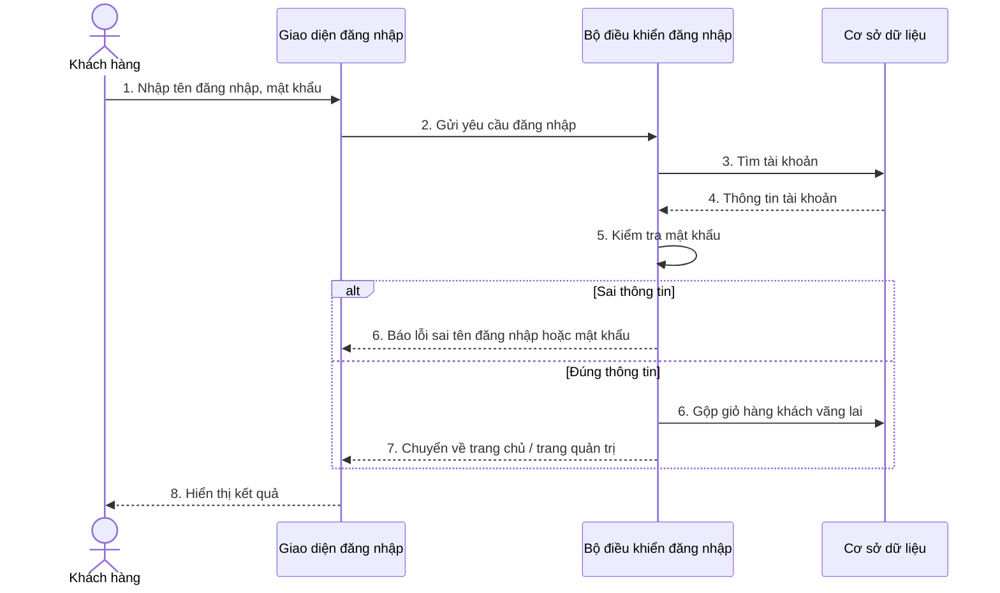
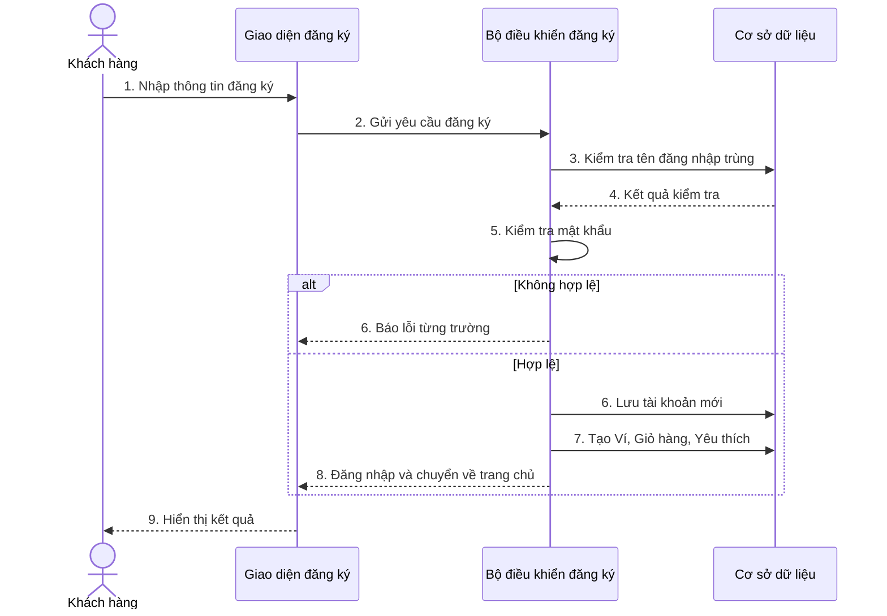
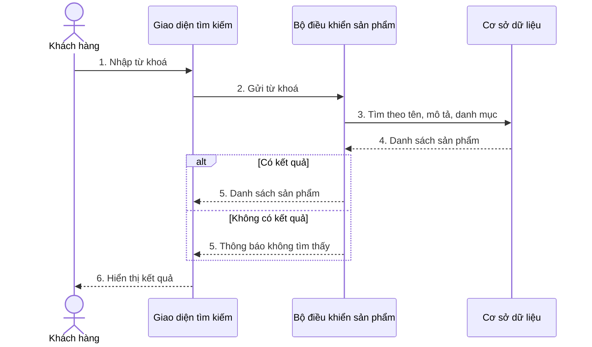
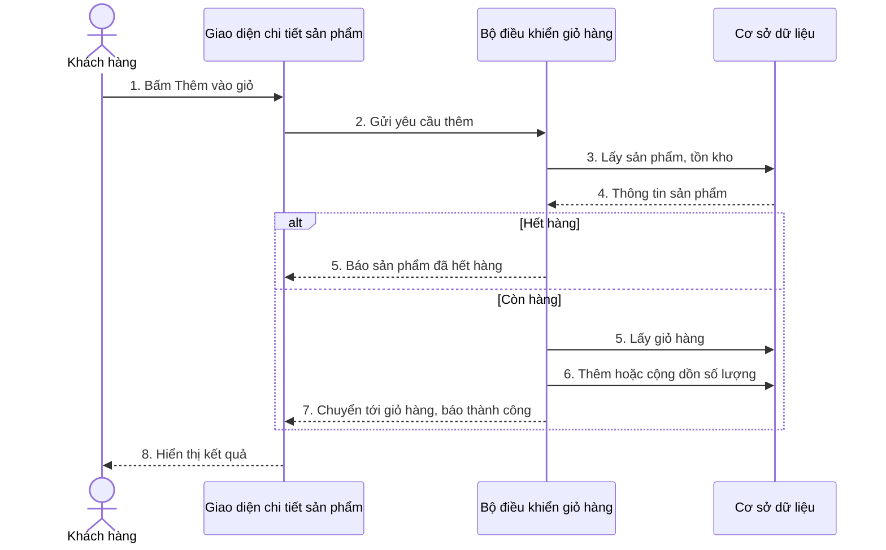
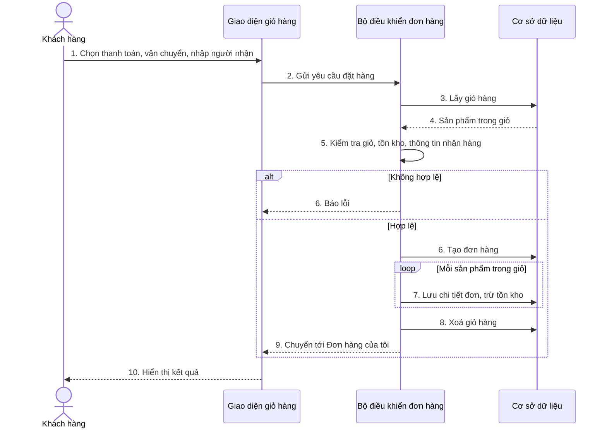
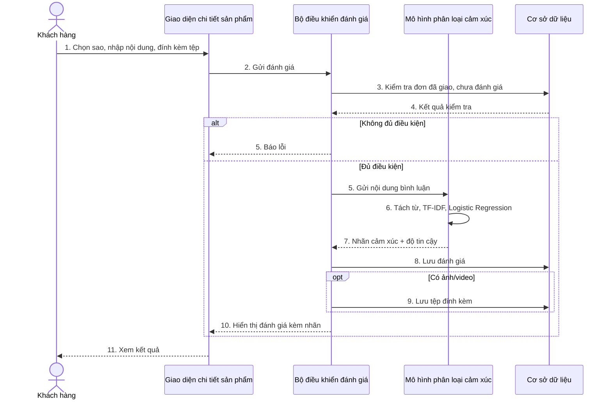
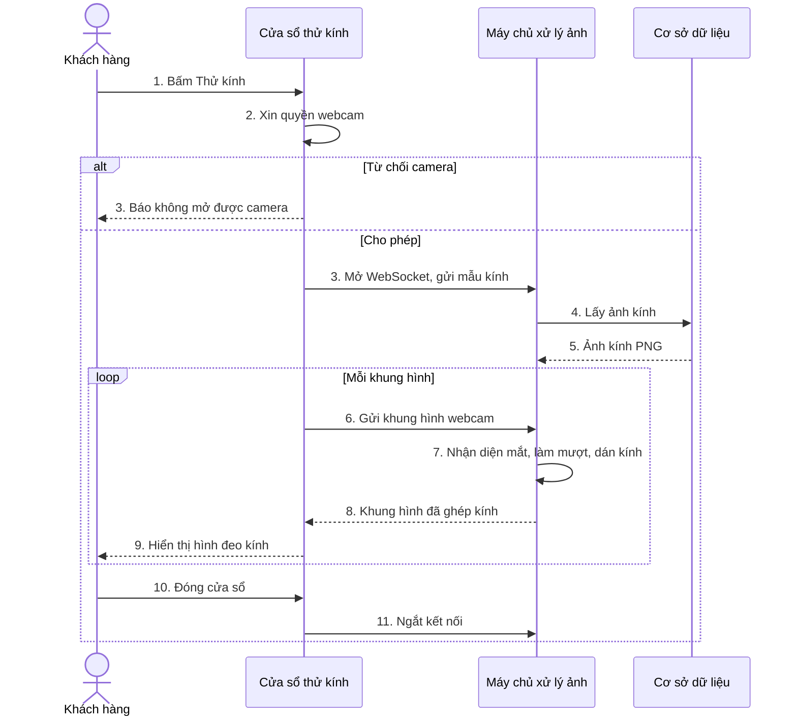

# Hướng dẫn vẽ Sơ đồ tuần tự (Sequence Diagram) — Astraea Eyewear

Bản rút gọn, dễ vẽ, dùng để đưa vào báo cáo. Nội dung đã đối chiếu với báo cáo
`Bao_cao_chuyen_de_TN_..._Copy.final.docx` và mã nguồn hiện tại (`accounts/`,
`cart/`, `orders/`, `reviews/`, `tryon/`). Bản kỹ thuật chi tiết (tên hàm,
câu SQL, từng tham số) vẫn nằm ở `PhanTich_Class_Sequence_Activity.md` mục 2 —
file này chỉ giữ phần cần để vẽ.

---

## 0. Báo cáo đang thiếu gì?

Chương 3 của báo cáo hiện có: 3.1 Quy trình tổng quát, 3.2 Use case, 3.3–3.5
ERD và mô tả bảng. **Chưa có sơ đồ tuần tự nào.** Đề xuất thêm một mục mới:

> **3.6. Sơ đồ tuần tự** — đặt sau 3.5, gồm các hình 3.3 → 3.9 (xem bảng ở
> mục 2). Khi chèn hình xong nhớ cập nhật lại "Danh mục hình vẽ".

---

## 1. Quy ước chung (áp dụng cho mọi sơ đồ)

### 1.1. Chỉ dùng 4–5 cột (lifeline), luôn theo thứ tự trái → phải

| # | Cột | Ký hiệu trong draw.io | Ý nghĩa trong đồ án |
|---|---|---|---|
| 1 | **Khách hàng** / **Quản trị viên** | Hình người (Actor) | Người bấm nút |
| 2 | **Giao diện** | Lifeline có biểu tượng Boundary (hình tròn có gạch đứng) | Trang web / cửa sổ (template HTML) |
| 3 | **Bộ điều khiển** | Lifeline có biểu tượng Control (hình tròn có mũi tên) | Hàm view trong Django |
| 4 | *(tuỳ sơ đồ)* **Dịch vụ** | Lifeline thường | Mô hình AI, bộ xử lý ảnh… — chỉ thêm khi có |
| 5 | **Cơ sở dữ liệu** | Lifeline có biểu tượng Entity hoặc hình trụ | MySQL |

> Không cần vẽ từng Model (Order, OrderItem, Product…) thành cột riêng — gộp hết
> vào cột "Cơ sở dữ liệu" và ghi tên bảng trong nội dung thông điệp. Cách này
> giúp sơ đồ gọn, đủ ý và giống mẫu thường gặp trong đồ án.

### 1.2. Mũi tên

| Loại | Nét vẽ | Dùng khi |
|---|---|---|
| Gọi / yêu cầu | Nét **liền**, đầu mũi tên **đặc** | Cột trái gửi yêu cầu sang cột phải |
| Trả về | Nét **đứt**, đầu mũi tên **rỗng** | Kết quả trả ngược lại |
| Tự gọi | Mũi tên vòng về chính cột đó | Bộ điều khiển tự kiểm tra dữ liệu |

### 1.3. Nội dung thông điệp

- Đánh số thứ tự: `1: Nhập thông tin`, `2: Gửi yêu cầu đăng nhập`…
- Viết **tiếng Việt, ngắn** (≤ 6–7 chữ). Không ghi tên hàm Python, không ghi SQL.
- Mỗi sơ đồ chỉ nên 8–12 mũi tên.

### 1.4. Khung điều kiện (combined fragment)

| Khung | Dùng khi | Ví dụ |
|---|---|---|
| **alt** | Có 2 nhánh: hợp lệ / không hợp lệ | Sai mật khẩu ↔ đúng mật khẩu |
| **opt** | Có thể xảy ra hoặc không | Có đính kèm ảnh thì lưu ảnh |
| **loop** | Lặp lại | Lặp từng sản phẩm trong giỏ |

Mỗi sơ đồ **tối đa 1 alt + 1 loop/opt** để dễ đọc. Điều kiện ghi trong ngoặc
vuông ở góc khung, ví dụ `[Thông tin hợp lệ]`, `[Ngược lại]`.

### 1.5. Thanh kích hoạt (activation)

Hình chữ nhật dọc hẹp trên lifeline, bắt đầu khi cột nhận yêu cầu và kết thúc
khi trả kết quả. Có thể bỏ qua nếu thấy rối — không bắt buộc.

---

## 2. Danh sách sơ đồ nên vẽ

| Hình | Tên sơ đồ | Use case tương ứng | Mức ưu tiên |
|---|---|---|---|
| 3.3 | Đăng nhập | UC1 Đăng nhập/Đăng ký | Bắt buộc |
| 3.4 | Đăng ký tài khoản | UC1 Đăng nhập/Đăng ký | Nên có |
| 3.5 | Tìm kiếm sản phẩm | UC2 Xem và tìm kiếm | Nên có |
| 3.6 | Thêm sản phẩm vào giỏ hàng | UC4 Quản lí giỏ hàng | Bắt buộc |
| 3.7 | Đặt hàng và thanh toán | UC5 | **Bắt buộc** |
| 3.8 | Đánh giá sản phẩm và phân loại cảm xúc | UC7 | **Bắt buộc** (điểm nhấn AI) |
| 3.9 | Thử kính ảo | UC3 | **Bắt buộc** (điểm nhấn AI) |
| 3.10 | Huỷ đơn hàng | UC6 Theo dõi đơn hàng | Tuỳ chọn |
| 3.11 | Quản trị viên cập nhật trạng thái giao hàng | UC10 Quản lí đơn hàng | Tuỳ chọn |

Nếu ít thời gian: vẽ 3.3, 3.6, 3.7, 3.8, 3.9 là đủ bao phủ các chức năng chính.

Mỗi sơ đồ bên dưới có: **các cột**, **bảng các bước** (chép thẳng lên mũi tên),
**khung điều kiện**, và **mã Mermaid** để xem trước (dán vào
https://mermaid.live — không cần cài gì).

---

## 3. Chi tiết từng sơ đồ

### Hình 3.3. Sơ đồ tuần tự Đăng nhập

**Các cột:** Khách hàng · Giao diện đăng nhập · Bộ điều khiển đăng nhập · Cơ sở dữ liệu

| Bước | Từ → Đến | Nội dung mũi tên | Loại |
|---|---|---|---|
| 1 | Khách hàng → Giao diện | Nhập tên đăng nhập, mật khẩu | Gọi |
| 2 | Giao diện → Bộ điều khiển | Gửi yêu cầu đăng nhập | Gọi |
| 3 | Bộ điều khiển → CSDL | Tìm tài khoản theo tên đăng nhập | Gọi |
| 4 | CSDL → Bộ điều khiển | Trả thông tin tài khoản | Trả về |
| 5 | Bộ điều khiển → Bộ điều khiển | Kiểm tra mật khẩu | Tự gọi |
| **alt** `[Sai thông tin]` | | | |
| 6a | Bộ điều khiển → Giao diện | Báo lỗi "Sai tên đăng nhập hoặc mật khẩu" | Trả về |
| **else** `[Đúng thông tin]` | | | |
| 6b | Bộ điều khiển → CSDL | Gộp giỏ hàng khách vãng lai vào tài khoản | Gọi |
| 7b | Bộ điều khiển → Giao diện | Chuyển về trang chủ (admin → trang quản trị) | Trả về |
| 8 | Giao diện → Khách hàng | Hiển thị kết quả | Trả về |

---

### Hình 3.4. Sơ đồ tuần tự Đăng ký tài khoản

**Các cột:** Khách hàng · Giao diện đăng ký · Bộ điều khiển đăng ký · Cơ sở dữ liệu

| Bước | Từ → Đến | Nội dung mũi tên |
|---|---|---|
| 1 | Khách hàng → Giao diện | Nhập tên đăng nhập, email, SĐT, địa chỉ, mật khẩu |
| 2 | Giao diện → Bộ điều khiển | Gửi yêu cầu đăng ký |
| 3 | Bộ điều khiển → CSDL | Kiểm tra tên đăng nhập đã tồn tại chưa |
| 4 | CSDL → Bộ điều khiển | Kết quả kiểm tra |
| 5 | Bộ điều khiển → Bộ điều khiển | Kiểm tra độ mạnh và khớp mật khẩu |
| **alt** `[Không hợp lệ]` 6a | Bộ điều khiển → Giao diện | Báo lỗi từng trường |
| **else** `[Hợp lệ]` 6b | Bộ điều khiển → CSDL | Lưu tài khoản mới |
| 7b | Bộ điều khiển → CSDL | Tự tạo Ví, Giỏ hàng, Danh sách yêu thích |
| 8b | Bộ điều khiển → Giao diện | Tự đăng nhập, chuyển về trang chủ |

---

### Hình 3.5. Sơ đồ tuần tự Tìm kiếm sản phẩm

**Các cột:** Khách hàng · Giao diện tìm kiếm · Bộ điều khiển sản phẩm · Cơ sở dữ liệu

| Bước | Từ → Đến | Nội dung mũi tên |
|---|---|---|
| 1 | Khách hàng → Giao diện | Nhập từ khoá, bấm Tìm |
| 2 | Giao diện → Bộ điều khiển | Gửi từ khoá tìm kiếm |
| 3 | Bộ điều khiển → CSDL | Tìm sản phẩm đang bán theo tên, mô tả, danh mục |
| 4 | CSDL → Bộ điều khiển | Danh sách sản phẩm |
| **alt** `[Có kết quả]` 5a | Bộ điều khiển → Giao diện | Hiển thị danh sách sản phẩm |
| **else** `[Không có]` 5b | Bộ điều khiển → Giao diện | Hiển thị "Không tìm thấy sản phẩm" |

---

### Hình 3.6. Sơ đồ tuần tự Thêm sản phẩm vào giỏ hàng

**Các cột:** Khách hàng · Giao diện chi tiết sản phẩm · Bộ điều khiển giỏ hàng · Cơ sở dữ liệu

| Bước | Từ → Đến | Nội dung mũi tên |
|---|---|---|
| 1 | Khách hàng → Giao diện | Chọn số lượng, bấm "Thêm vào giỏ" |
| 2 | Giao diện → Bộ điều khiển | Gửi yêu cầu thêm vào giỏ |
| 3 | Bộ điều khiển → CSDL | Lấy thông tin sản phẩm, tồn kho |
| 4 | CSDL → Bộ điều khiển | Thông tin sản phẩm |
| **alt** `[Hết hàng]` 5a | Bộ điều khiển → Giao diện | Báo "Sản phẩm đã hết hàng" |
| **else** `[Còn hàng]` 5b | Bộ điều khiển → CSDL | Lấy giỏ hàng (theo tài khoản hoặc phiên khách) |
| 6b | Bộ điều khiển → CSDL | Thêm sản phẩm / cộng dồn số lượng |
| 7b | Bộ điều khiển → Giao diện | Chuyển tới trang giỏ hàng, báo thêm thành công |

---

### Hình 3.7. Sơ đồ tuần tự Đặt hàng và thanh toán

**Các cột:** Khách hàng · Giao diện giỏ hàng · Bộ điều khiển đơn hàng · Cơ sở dữ liệu

Ghi chú nên đặt dưới hình: *Thanh toán là giả lập, không gọi cổng thanh toán
thật; toàn bộ bước lưu đơn chạy trong một giao dịch (transaction) — lỗi giữa
chừng thì huỷ toàn bộ.*

| Bước | Từ → Đến | Nội dung mũi tên |
|---|---|---|
| 1 | Khách hàng → Giao diện | Chọn hình thức thanh toán, đơn vị vận chuyển, nhập người nhận |
| 2 | Giao diện → Bộ điều khiển | Gửi yêu cầu đặt hàng |
| 3 | Bộ điều khiển → CSDL | Lấy giỏ hàng và sản phẩm trong giỏ |
| 4 | CSDL → Bộ điều khiển | Danh sách sản phẩm trong giỏ |
| 5 | Bộ điều khiển → Bộ điều khiển | Kiểm tra giỏ, tồn kho, thông tin nhận hàng |
| **alt** `[Không hợp lệ]` 6a | Bộ điều khiển → Giao diện | Báo lỗi, quay lại giỏ hàng |
| **else** `[Hợp lệ]` 6b | Bộ điều khiển → CSDL | Tạo đơn hàng |
| **loop** `[Mỗi sản phẩm trong giỏ]` 7b | Bộ điều khiển → CSDL | Lưu chi tiết đơn, trừ tồn kho |
| 8b | Bộ điều khiển → CSDL | Xoá giỏ hàng |
| 9b | Bộ điều khiển → Giao diện | Chuyển tới "Đơn hàng của tôi", báo thành công |

---

### Hình 3.8. Sơ đồ tuần tự Đánh giá sản phẩm và phân loại cảm xúc

**Các cột:** Khách hàng · Giao diện chi tiết sản phẩm · Bộ điều khiển đánh giá ·
**Mô hình phân loại cảm xúc** · Cơ sở dữ liệu

(Sơ đồ này có 5 cột vì cần thể hiện phần AI — đây là điểm nhấn của đồ án.)

| Bước | Từ → Đến | Nội dung mũi tên |
|---|---|---|
| 1 | Khách hàng → Giao diện | Chọn số sao, nhập nội dung, đính kèm ảnh/video |
| 2 | Giao diện → Bộ điều khiển | Gửi đánh giá |
| 3 | Bộ điều khiển → CSDL | Kiểm tra đơn đã giao và chưa đánh giá |
| 4 | CSDL → Bộ điều khiển | Kết quả kiểm tra |
| **alt** `[Không đủ điều kiện]` 5a | Bộ điều khiển → Giao diện | Báo lỗi |
| **else** `[Đủ điều kiện]` 5b | Bộ điều khiển → Mô hình | Gửi nội dung bình luận |
| 6b | Mô hình → Mô hình | Làm sạch, tách từ, TF-IDF, Logistic Regression |
| 7b | Mô hình → Bộ điều khiển | Nhãn cảm xúc (Tích cực/Trung lập/Tiêu cực) + độ tin cậy |
| 8b | Bộ điều khiển → CSDL | Lưu đánh giá kèm nhãn cảm xúc |
| **opt** `[Có ảnh/video]` 9b | Bộ điều khiển → CSDL | Lưu tệp đính kèm (tối đa 5) |
| 10b | Bộ điều khiển → Giao diện | Hiển thị đánh giá kèm nhãn cảm xúc |

---

### Hình 3.9. Sơ đồ tuần tự Thử kính ảo

**Các cột:** Khách hàng · Cửa sổ thử kính (trình duyệt + webcam) · Máy chủ
xử lý ảnh (WebSocket) · Cơ sở dữ liệu

Ghi chú nên đặt dưới hình: *Kết nối WebSocket giữ mở suốt phiên thử, trình duyệt
gửi khoảng 25 khung hình/giây; nhận diện khuôn mặt dùng MediaPipe, dán kính
bằng OpenCV.*

| Bước | Từ → Đến | Nội dung mũi tên |
|---|---|---|
| 1 | Khách hàng → Cửa sổ | Bấm "Thử kính" |
| 2 | Cửa sổ → Cửa sổ | Xin quyền mở webcam |
| **alt** `[Từ chối camera]` 3a | Cửa sổ → Khách hàng | Báo không mở được camera |
| **else** `[Cho phép]` 3b | Cửa sổ → Máy chủ | Mở kết nối WebSocket, gửi mẫu kính đã chọn |
| 4b | Máy chủ → CSDL | Lấy ảnh kính (PNG) của mẫu |
| 5b | CSDL → Máy chủ | Ảnh kính |
| **loop** `[Mỗi khung hình]` 6b | Cửa sổ → Máy chủ | Gửi khung hình webcam |
| 7b | Máy chủ → Máy chủ | Nhận diện mắt, làm mượt, dán kính |
| 8b | Máy chủ → Cửa sổ | Trả khung hình đã ghép kính |
| 9b | Cửa sổ → Khách hàng | Hiển thị hình đeo kính |
| 10 | Khách hàng → Cửa sổ | Đóng cửa sổ → ngắt kết nối, tắt camera |

---

### Hình 3.10 (tuỳ chọn). Sơ đồ tuần tự Huỷ đơn hàng

**Các cột:** Khách hàng · Giao diện đơn hàng của tôi · Bộ điều khiển đơn hàng · Cơ sở dữ liệu

| Bước | Từ → Đến | Nội dung mũi tên |
|---|---|---|
| 1 | Khách hàng → Giao diện | Bấm "Huỷ đơn" |
| 2 | Giao diện → Bộ điều khiển | Gửi yêu cầu huỷ đơn |
| 3 | Bộ điều khiển → CSDL | Lấy đơn hàng của người dùng |
| 4 | CSDL → Bộ điều khiển | Thông tin đơn |
| **alt** `[Đơn đã huỷ trước đó]` 5a | Bộ điều khiển → Giao diện | Báo "Đơn đã được huỷ từ trước" |
| **else** 5b | Bộ điều khiển → CSDL | Đổi trạng thái đơn thành Đã huỷ |
| **loop** `[Mỗi sản phẩm trong đơn]` 6b | Bộ điều khiển → CSDL | Hoàn lại tồn kho |
| 7b | Bộ điều khiển → Giao diện | Báo huỷ thành công |

---

### Hình 3.11 (tuỳ chọn). Sơ đồ tuần tự Quản trị viên cập nhật trạng thái giao hàng

**Các cột:** Quản trị viên · Giao diện trang quản trị · Bộ điều khiển quản trị · Cơ sở dữ liệu

| Bước | Từ → Đến | Nội dung mũi tên |
|---|---|---|
| 1 | Quản trị viên → Giao diện | Mở danh sách đơn hàng |
| 2 | Giao diện → Bộ điều khiển | Yêu cầu danh sách đơn |
| 3 | Bộ điều khiển → CSDL | Lấy danh sách đơn |
| 4 | CSDL → Bộ điều khiển → Giao diện | Danh sách đơn |
| 5 | Quản trị viên → Giao diện | Chọn đơn, đổi trạng thái giao hàng, bấm Lưu |
| 6 | Giao diện → Bộ điều khiển | Gửi trạng thái mới |
| 7 | Bộ điều khiển → CSDL | Cập nhật trạng thái giao hàng |
| 8 | Bộ điều khiển → Giao diện | Báo lưu thành công |

(Không có alt: trang quản trị chỉ cho sửa đúng một trường trạng thái giao hàng,
các trường khác chỉ đọc.)

---

## 4. Các bước vẽ trong draw.io (diagrams.net)

1. Mở draw.io → **Create New Diagram** → chọn **Blank Diagram**.
2. Ô tìm kiếm hình bên trái gõ `uml` → bật thư viện **UML** (hoặc bấm
   *More Shapes* → tick **UML** → Apply).
3. **Kéo cột:**
   - Actor: kéo hình **Actor** (người que), kéo thêm một đường nét đứt dọc
     bên dưới (hoặc dùng *Lifeline* có actor sẵn).
   - Các cột còn lại: kéo hình **Lifeline** (hộp có đường đứt dọc), đổi tên.
     Muốn có biểu tượng Boundary/Control/Entity: tìm `boundary`, `control`,
     `entity` trong ô tìm kiếm.
   - Đặt các cột **cách đều nhau** (chọn tất cả → Arrange → Distribute →
     Horizontally), kéo cho tất cả **dài bằng nhau**.
4. **Vẽ mũi tên** từ trên xuống dưới theo bảng các bước:
   - Gọi: tìm `message` → chọn mũi tên nét liền, đầu đặc.
   - Trả về: chọn mũi tên **return** (nét đứt) — hoặc chọn mũi tên rồi ở
     bảng Style bên phải đổi *Pattern* thành nét đứt, đầu mũi tên rỗng.
   - Tự gọi: kéo mũi tên từ lifeline rồi thả lại chính lifeline đó, hoặc tìm
     `self call`.
   - Bấm đúp lên mũi tên để gõ nội dung (`1: Nhập tên đăng nhập…`).
5. **Khung alt/loop/opt:** tìm `fragment` hoặc `alt` → kéo khung bao trùm
   các mũi tên liên quan. Đổi nhãn góc trái thành `alt` / `loop` / `opt`.
   Với alt: kéo một đường nét đứt ngang chia khung làm 2, ghi `[Sai thông
   tin]` ở nửa trên, `[Đúng thông tin]` ở nửa dưới.
6. **Xuất ảnh:** File → Export as → PNG → *Zoom 200%*, *Border 10*, tick
   *Transparent background* bỏ trống (nền trắng) → Export. Chèn vào Word,
   căn giữa, thêm chú thích dạng `Hình 3.x. Sơ đồ tuần tự …` bằng style
   "Chu thich hinh" như các hình khác trong báo cáo.

**Mẹo nhanh:** vẽ xong một sơ đồ (ví dụ Đăng nhập), dùng *Duplicate page*
rồi sửa tên cột và nội dung mũi tên cho sơ đồ tiếp theo — các sơ đồ sẽ đồng
bộ kích thước và kiểu chữ.

---

## 5. Lỗi hay gặp — kiểm tra trước khi nộp

| Lỗi | Sửa thế nào |
|---|---|
| Mũi tên trả về vẽ nét liền | Đổi sang nét đứt, đầu rỗng |
| Actor nói chuyện thẳng với CSDL | Actor chỉ tương tác với **Giao diện** |
| Giao diện gọi thẳng CSDL | Phải đi qua **Bộ điều khiển** |
| Ghi tên hàm/SQL (`checkout()`, `SELECT …`) | Đổi sang câu tiếng Việt ngắn |
| Quá nhiều cột (Order, OrderItem, Product… riêng) | Gộp vào cột "Cơ sở dữ liệu" |
| Không đánh số thứ tự mũi tên | Đánh số 1, 2, 3… từ trên xuống |
| Khung alt không ghi điều kiện | Thêm `[điều kiện]` cho từng nhánh |
| Sơ đồ ghi "thanh toán qua MoMo" như gọi thật | Ghi rõ "thanh toán giả lập" |

---

## 6. Đoạn văn mẫu đặt trước mỗi hình trong báo cáo

> *Hình 3.7 mô tả trình tự xử lý khi khách hàng đặt hàng. Sau khi khách chọn
> hình thức thanh toán, đơn vị vận chuyển và nhập thông tin người nhận, bộ
> điều khiển đơn hàng kiểm tra giỏ hàng, tồn kho và thông tin nhận hàng. Nếu
> hợp lệ, hệ thống tạo đơn, lưu từng dòng sản phẩm với giá tại thời điểm mua,
> trừ tồn kho và xoá giỏ hàng trong cùng một giao dịch; ngược lại hệ thống báo
> lỗi và giữ nguyên giỏ hàng.*

Viết tương tự cho các hình khác: 2–4 câu, nêu **ai bắt đầu → hệ thống kiểm tra
gì → nhánh thành công → nhánh lỗi**.
