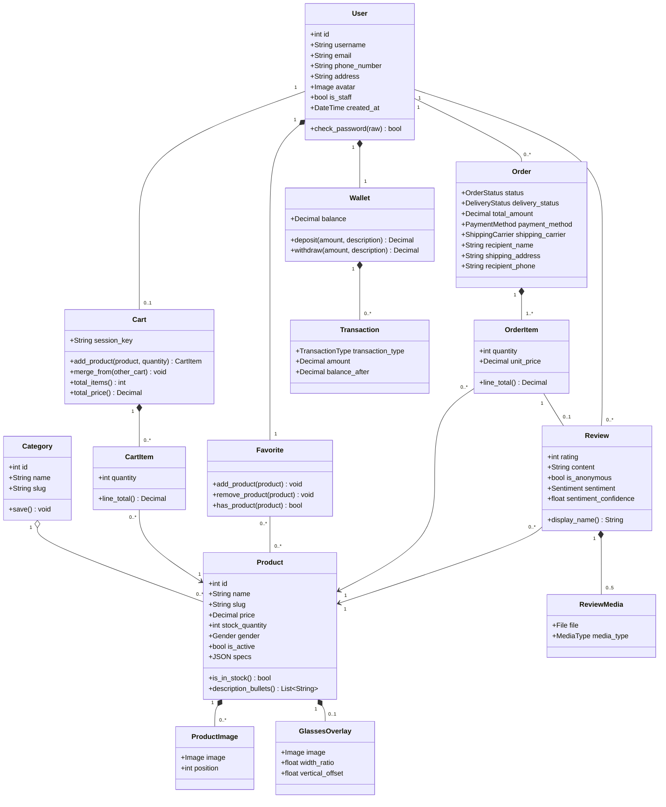
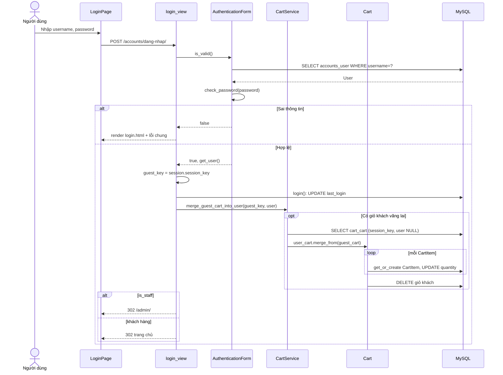
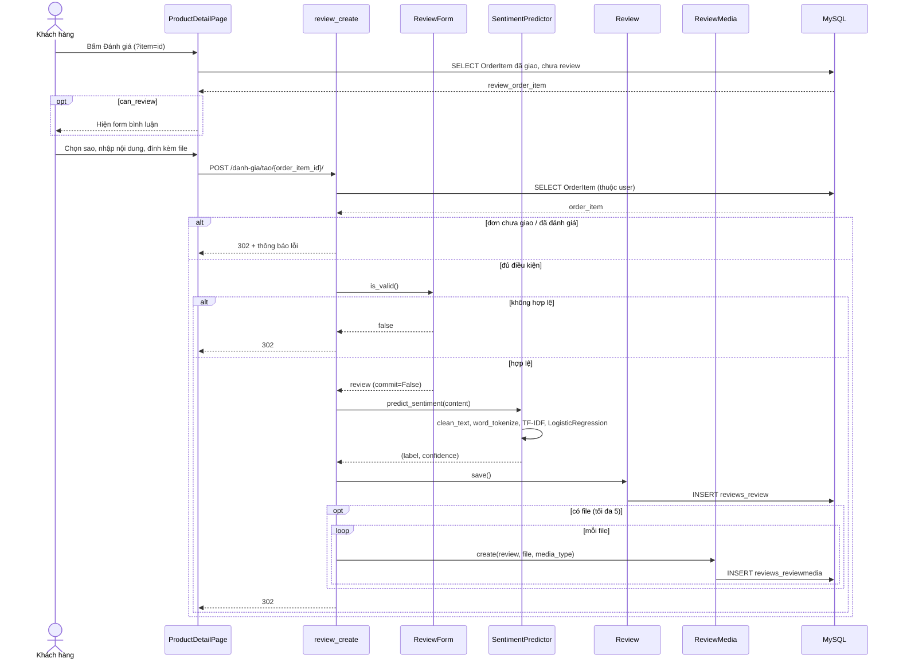
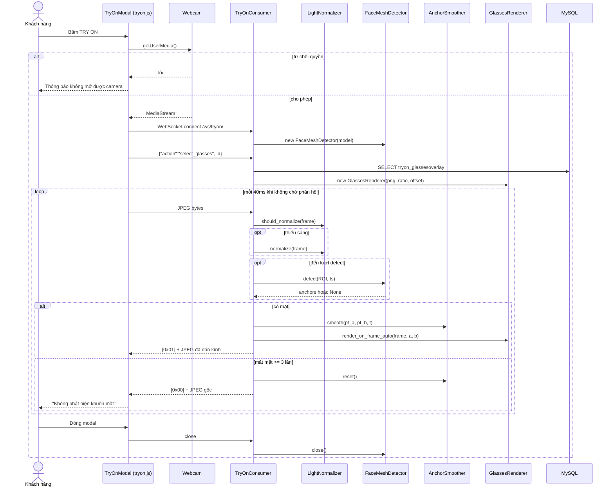
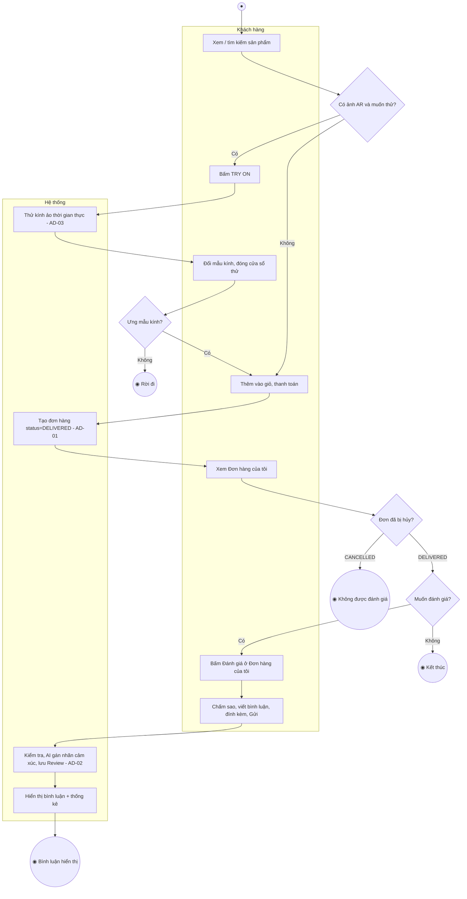
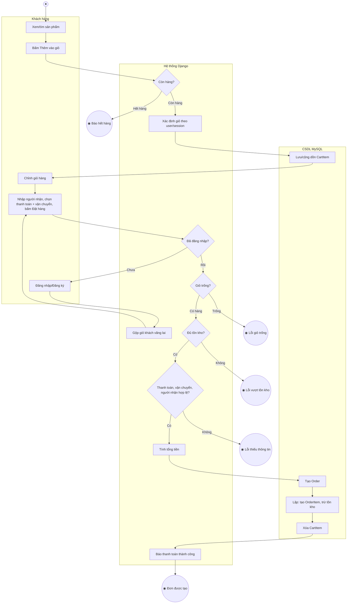
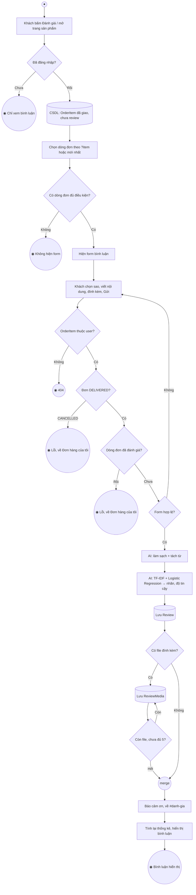
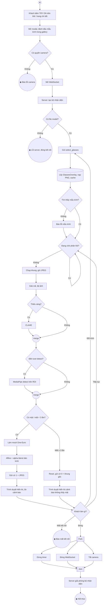

# Phân tích Class Diagram, Sequence Diagram, Activity Diagram — Astraea Eyewear

Tài liệu này được đối chiếu trực tiếp từ mã nguồn đồ án (không suy đoán), dùng làm đầu vào để vẽ 3 loại sơ đồ UML.

**Nguồn đã đọc:**

| Nguồn | Nội dung lấy ra |
|---|---|
| `*/models.py` (accounts, products, cart, favorites, orders, reviews, tryon, wallet) | Lớp thực thể, thuộc tính, kiểu dữ liệu, phương thức, quan hệ |
| `astraea_eyewear_db.sql` | Tên bảng thật trong CSDL `astraea_eyewear_db` |
| `accounts/views.py`, `accounts/forms.py`, `accounts/signals.py` | Đăng ký, đăng nhập, quên mật khẩu, hồ sơ |
| `cart/views.py`, `cart/services.py` | Giỏ hàng (kể cả khách vãng lai), gộp giỏ |
| `orders/views.py`, `orders/admin.py` | Đặt hàng/thanh toán, hủy đơn, quản trị đơn |
| `reviews/views.py`, `reviews/forms.py`, `reviews/ml/sentiment.py` | Đánh giá + phân loại cảm xúc (TF-IDF + Logistic Regression) |
| `products/views.py`, `favorites/views.py` | Xem/tìm sản phẩm, yêu thích |
| `tryon/consumers.py`, `tryon/vision.py`, `static/js/tryon.js` | Thử kính ảo qua WebSocket (MediaPipe + OpenCV) |
| `bug_promtp/usecase_dac_ta.md` | Danh sách use case để chọn chức năng vẽ sequence/activity |

Kiến trúc: **Django MVT** (Model – View – Template), tương ứng khi vẽ UML:

| Vai trò UML | Thành phần trong Astraea |
|---|---|
| Boundary / UI | Template HTML (`templates/...html`), JS (`main.js`, `tryon.js`, `review-form.js`), trang Django Admin |
| Controller | Hàm view (`checkout()`, `login_view()`...), `TryOnConsumer` (WebSocket) |
| Service | `merge_guest_cart_into_user()`, `predict_sentiment()`, Form (`RegisterForm`, `ReviewForm`...), lớp xử lý ảnh (`FaceMeshDetector`, `GlassesRenderer`...) |
| Model / Entity | Các lớp Django Model (mục 1) |
| Database | MySQL `astraea_eyewear_db` (qua Django ORM) |

---

## 1. CLASS DIAGRAM

### 1.1. Danh sách các lớp

**a) Lớp thực thể (Entity) — ánh xạ 1-1 với bảng CSDL**

| STT | Lớp | Bảng MySQL | App | Ý nghĩa |
|---|---|---|---|---|
| 1 | `User` | `accounts_user` | accounts | Người dùng (khách hàng + quản trị viên, phân biệt bằng `is_staff`/`is_superuser`) |
| 2 | `Category` | `products_category` | products | Danh mục kính theo dáng gọng |
| 3 | `Product` | `products_product` | products | Sản phẩm kính |
| 4 | `ProductImage` | `products_productimage` | products | Ảnh gallery phụ của sản phẩm |
| 5 | `Cart` | `cart_cart` | cart | Giỏ hàng (của tài khoản hoặc của phiên khách vãng lai) |
| 6 | `CartItem` | `cart_cartitem` | cart | Một dòng sản phẩm trong giỏ |
| 7 | `Favorite` | `favorites_favorite` (+ bảng nối `favorites_favorite_products`) | favorites | Danh sách yêu thích |
| 8 | `Order` | `orders_order` | orders | Đơn hàng |
| 9 | `OrderItem` | `orders_orderitem` | orders | Một dòng sản phẩm trong đơn (bằng chứng đã mua) |
| 10 | `Review` | `reviews_review` | reviews | Đánh giá sản phẩm + nhãn cảm xúc AI |
| 11 | `ReviewMedia` | `reviews_reviewmedia` | reviews | Ảnh/video đính kèm đánh giá |
| 12 | `GlassesOverlay` | `tryon_glassesoverlay` | tryon | Ảnh PNG kính AR dùng để thử kính ảo |
| 13 | `Wallet` | `wallet_wallet` | wallet | Ví điện tử |
| 14 | `Transaction` | `wallet_transaction` | wallet | Lịch sử giao dịch ví |

**b) Kiểu liệt kê (Enumeration) — vẽ bằng stereotype `<<enumeration>>`**

| Enum | Thuộc lớp | Giá trị (mã — nhãn hiển thị) |
|---|---|---|
| `Gender` | Product | `nu` — Nữ; `nam` — Nam; `unisex` — Unisex |
| `OrderStatus` (`Order.Status`) | Order | `DELIVERED` — Giao hàng thành công; `CANCELLED` — Đã hủy |
| `PaymentMethod` | Order | `COD`; `MOMO` — Ví MoMo; `CARD` — Thẻ ngân hàng |
| `ShippingCarrier` | Order | `GHN`; `GHTK`; `SPX`; `VIETTEL_POST`; `JT` |
| `DeliveryStatus` | Order | `PENDING` — Chờ giao; `IN_TRANSIT` — Đang vận chuyển; `DELIVERED` — Giao thành công; `FAILED` — Giao thất bại |
| `Sentiment` | Review | `POS` — Tích cực; `NEU` — Trung lập; `NEG` — Tiêu cực |
| `MediaType` | ReviewMedia | `image` — Ảnh; `video` — Video |
| `TransactionType` | Transaction | `DEPOSIT` — Nạp tiền; `PAYMENT` — Thanh toán |

**c) Lớp xử lý (Control/Service) — tùy chọn, nên vẽ ở class diagram riêng cho module Thử kính ảo**

| Lớp | File | Vai trò |
|---|---|---|
| `TryOnConsumer` | `tryon/consumers.py` | Controller WebSocket, điều phối pipeline xử lý từng khung hình |
| `FaceMeshDetector` | `tryon/vision.py` | Bọc MediaPipe FaceLandmarker (chế độ VIDEO) |
| `LightNormalizer` | `tryon/vision.py` | Chuẩn hóa ánh sáng bằng CLAHE |
| `GlassesRenderer` (tên thật trong `vision.py` là `GlassesOverlay`, được import với alias `GlassesRenderer` để tránh trùng tên với Model) | `tryon/vision.py` | Căn và dán ảnh kính lên khung hình (affine + alpha blend) |
| `AnchorSmoother` | `tryon/vision.py` | Làm mượt 2 điểm neo mắt bằng 4 bộ lọc One-Euro |
| `OneEuroFilter` | `tryon/vision.py` | Bộ lọc One-Euro cho 1 đại lượng |
| `SentimentPredictor` (module `reviews/ml/sentiment.py`, không phải class) | `reviews/ml/sentiment.py` | Dự đoán nhãn cảm xúc; có thể vẽ dạng lớp `<<utility>>` |

### 1.2. Thuộc tính & kiểu dữ liệu từng lớp

Quy ước: kiểu UML ghi theo kiểu logic; cột "Kiểu Django / MySQL" ghi kiểu thật. `PK` = khóa chính, `FK` = khóa ngoại, `UQ` = duy nhất. Mọi lớp đều có `id: int` (PK, tự tăng) do Django tự sinh.

#### 1) User (kế thừa `AbstractUser` của Django)

| Thuộc tính | Kiểu UML | Kiểu Django / MySQL | Ràng buộc | Mô tả |
|---|---|---|---|---|
| id | int | BigAutoField / bigint | PK | Mã người dùng |
| username | String | CharField(150) / varchar | UQ, bắt buộc | Tên đăng nhập |
| password | String | CharField(128) | bắt buộc | Mật khẩu đã băm (PBKDF2) |
| email | String | EmailField(254) | Bắt buộc ở form đăng ký (không UQ trong CSDL) | Email |
| first_name | String | CharField(150) | có thể trống | Tên |
| last_name | String | CharField(150) | có thể trống | Họ |
| phone_number | String | CharField(15) | có thể trống | Số điện thoại |
| address | String | CharField(255) | có thể trống | Địa chỉ |
| avatar | Image | ImageField → `avatars/` | null | Ảnh đại diện |
| is_active | bool | BooleanField | mặc định true | Tài khoản còn hoạt động |
| is_staff | bool | BooleanField | mặc định false | Được vào trang quản trị |
| is_superuser | bool | BooleanField | mặc định false | Toàn quyền |
| last_login | DateTime | DateTimeField | null | Lần đăng nhập gần nhất |
| date_joined | DateTime | DateTimeField | tự sinh | Ngày tham gia (của Django) |
| created_at | DateTime | DateTimeField(auto_now_add) | tự sinh | Ngày tạo tài khoản |

#### 2) Category

| Thuộc tính | Kiểu UML | Kiểu Django / MySQL | Ràng buộc | Mô tả |
|---|---|---|---|---|
| id | int | BigAutoField | PK | |
| name | String | CharField(100) | UQ | Tên danh mục |
| slug | String | SlugField(120) | UQ, tự sinh từ name | Đường dẫn thân thiện |
| created_at | DateTime | DateTimeField(auto_now_add) | | Ngày tạo |

#### 3) Product

| Thuộc tính | Kiểu UML | Kiểu Django / MySQL | Ràng buộc | Mô tả |
|---|---|---|---|---|
| id | int | BigAutoField | PK | |
| category | Category | ForeignKey → Category | FK, CASCADE | Danh mục |
| created_by | User | ForeignKey → User | FK, null, SET_NULL | Người tạo sản phẩm |
| name | String | CharField(200) | bắt buộc | Tên sản phẩm |
| slug | String | SlugField(220) | UQ, tự sinh | Đường dẫn thân thiện |
| description | String | TextField | có thể trống | Mô tả (đoạn giới thiệu + dòng "- " đặc điểm) |
| price | Decimal | DecimalField(12,2) | ≥ 0 | Giá bán (VNĐ) |
| stock_quantity | int | PositiveIntegerField | ≥ 0, mặc định 0 | Tồn kho |
| gender | Gender | CharField(10, choices) | mặc định `unisex` | Giới tính |
| image | Image | ImageField → `products/` | null | Ảnh chính |
| is_active | bool | BooleanField | mặc định true | Đang bày bán |
| sku | String | CharField(64) | có thể trống | Mã SKU |
| specs | JSON (dict) | JSONField | mặc định `{}` | Thông số kỹ thuật |
| care_instructions | String | TextField | có thể trống | Hướng dẫn bảo quản |
| created_at | DateTime | DateTimeField(auto_now_add) | | Ngày tạo |
| updated_at | DateTime | DateTimeField(auto_now) | | Ngày cập nhật |

#### 4) ProductImage

| Thuộc tính | Kiểu UML | Kiểu Django / MySQL | Ràng buộc | Mô tả |
|---|---|---|---|---|
| id | int | BigAutoField | PK | |
| product | Product | ForeignKey → Product | FK, CASCADE | Sản phẩm |
| image | Image | ImageField → `products/gallery/` | bắt buộc | Ảnh |
| position | int | PositiveIntegerField | mặc định 0 | Thứ tự hiển thị |

#### 5) Cart

| Thuộc tính | Kiểu UML | Kiểu Django / MySQL | Ràng buộc | Mô tả |
|---|---|---|---|---|
| id | int | BigAutoField | PK | |
| user | User | OneToOneField → User | FK UQ, **null** (khách vãng lai), CASCADE | Chủ giỏ |
| session_key | String | CharField(40) | UQ, null | Khóa phiên của khách chưa đăng nhập |
| created_at | DateTime | DateTimeField(auto_now_add) | | Ngày tạo |

#### 6) CartItem

| Thuộc tính | Kiểu UML | Kiểu Django / MySQL | Ràng buộc | Mô tả |
|---|---|---|---|---|
| id | int | BigAutoField | PK | |
| cart | Cart | ForeignKey → Cart | FK, CASCADE; UQ(cart, product) | Giỏ hàng |
| product | Product | ForeignKey → Product | FK, CASCADE | Sản phẩm |
| quantity | int | PositiveIntegerField | ≥ 1, mặc định 1 | Số lượng |
| added_at | DateTime | DateTimeField(auto_now_add) | | Thời điểm thêm |

#### 7) Favorite

| Thuộc tính | Kiểu UML | Kiểu Django / MySQL | Ràng buộc | Mô tả |
|---|---|---|---|---|
| id | int | BigAutoField | PK | |
| user | User | OneToOneField → User | FK UQ, CASCADE | Chủ danh sách |
| products | List<Product> | ManyToManyField → Product (bảng nối `favorites_favorite_products`) | có thể rỗng | Sản phẩm yêu thích |
| created_at | DateTime | DateTimeField(auto_now_add) | | Ngày tạo |

#### 8) Order

| Thuộc tính | Kiểu UML | Kiểu Django / MySQL | Ràng buộc | Mô tả |
|---|---|---|---|---|
| id | int | BigAutoField | PK | Mã đơn |
| user | User | ForeignKey → User | FK, CASCADE | Người mua |
| status | OrderStatus | CharField(20, choices) | mặc định `DELIVERED` | Trạng thái tổng của đơn |
| delivery_status | DeliveryStatus | CharField(20, choices) | mặc định `DELIVERED` | Trạng thái giao hàng (admin được sửa) |
| total_amount | Decimal | DecimalField(14,2) | ≥ 0 | Tổng tiền |
| payment_method | PaymentMethod | CharField(10, choices) | mặc định `COD` | Hình thức thanh toán |
| shipping_carrier | ShippingCarrier | CharField(20, choices) | mặc định `GHN` | Đơn vị vận chuyển |
| recipient_name | String | CharField(100) | bắt buộc (kiểm tra ở view) | Tên người nhận |
| shipping_address | String | CharField(255) | bắt buộc (kiểm tra ở view) | Địa chỉ nhận |
| recipient_phone | String | CharField(15) | bắt buộc (kiểm tra ở view) | SĐT người nhận |
| created_at | DateTime | DateTimeField(auto_now_add) | | Ngày đặt |

#### 9) OrderItem

| Thuộc tính | Kiểu UML | Kiểu Django / MySQL | Ràng buộc | Mô tả |
|---|---|---|---|---|
| id | int | BigAutoField | PK | |
| order | Order | ForeignKey → Order | FK, CASCADE | Đơn hàng |
| product | Product | ForeignKey → Product | FK, CASCADE | Sản phẩm |
| quantity | int | PositiveIntegerField | ≥ 1 | Số lượng |
| unit_price | Decimal | DecimalField(12,2) | ≥ 0 | Đơn giá **tại thời điểm mua** |

#### 10) Review

| Thuộc tính | Kiểu UML | Kiểu Django / MySQL | Ràng buộc | Mô tả |
|---|---|---|---|---|
| id | int | BigAutoField | PK | |
| product | Product | ForeignKey → Product | FK, CASCADE | Sản phẩm được đánh giá |
| user | User | ForeignKey → User | FK, CASCADE | Người đánh giá |
| order_item | OrderItem | OneToOneField → OrderItem | FK UQ, CASCADE | Bằng chứng đã mua (mỗi dòng đơn đánh giá 1 lần) |
| rating | int | PositiveSmallIntegerField | 1 ≤ rating ≤ 5 | Số sao |
| content | String | TextField | bắt buộc | Nội dung |
| is_anonymous | bool | BooleanField | mặc định false | Ẩn danh |
| sentiment | Sentiment | CharField(3, choices) | có thể trống; AI gán | Nhãn cảm xúc |
| sentiment_confidence | float | FloatField | null | Độ tin cậy (0..1) |
| created_at | DateTime | DateTimeField(auto_now_add) | | Ngày đánh giá |

#### 11) ReviewMedia

| Thuộc tính | Kiểu UML | Kiểu Django / MySQL | Ràng buộc | Mô tả |
|---|---|---|---|---|
| id | int | BigAutoField | PK | |
| review | Review | ForeignKey → Review | FK, CASCADE | Đánh giá |
| file | File | FileField → `reviews/%Y/%m/` | bắt buộc | Ảnh/video |
| media_type | MediaType | CharField(5, choices) | bắt buộc | Loại file |

#### 12) GlassesOverlay (Model)

| Thuộc tính | Kiểu UML | Kiểu Django / MySQL | Ràng buộc | Mô tả |
|---|---|---|---|---|
| id | int | BigAutoField | PK | |
| product | Product | OneToOneField → Product | FK UQ, CASCADE | Sản phẩm kính |
| image | Image | ImageField → `tryon/glasses/` | bắt buộc | PNG kính nền trong suốt |
| width_ratio | float | FloatField | mặc định 1.6 | Tỉ lệ bề rộng (chế độ dự phòng) |
| vertical_offset | float | FloatField | mặc định 0.0 | Độ lệch dọc (chế độ dự phòng) |
| created_at | DateTime | DateTimeField(auto_now_add) | | |
| updated_at | DateTime | DateTimeField(auto_now) | | |

#### 13) Wallet

| Thuộc tính | Kiểu UML | Kiểu Django / MySQL | Ràng buộc | Mô tả |
|---|---|---|---|---|
| id | int | BigAutoField | PK | |
| user | User | OneToOneField → User | FK UQ, CASCADE | Chủ ví |
| balance | Decimal | DecimalField(14,2) | ≥ 0, mặc định 0.00 | Số dư |
| created_at | DateTime | DateTimeField(auto_now_add) | | |
| updated_at | DateTime | DateTimeField(auto_now) | | |

#### 14) Transaction

| Thuộc tính | Kiểu UML | Kiểu Django / MySQL | Ràng buộc | Mô tả |
|---|---|---|---|---|
| id | int | BigAutoField | PK | |
| wallet | Wallet | ForeignKey → Wallet | FK, CASCADE | Ví |
| transaction_type | TransactionType | CharField(10, choices) | bắt buộc | Nạp / thanh toán |
| amount | Decimal | DecimalField(14,2) | ≥ 0.01 | Số tiền |
| balance_after | Decimal | DecimalField(14,2) | | Số dư sau giao dịch |
| description | String | CharField(255) | có thể trống | Ghi chú |
| created_at | DateTime | DateTimeField(auto_now_add) | | Thời gian giao dịch |

### 1.3. Phương thức (Operations) & kiểu trả về

Chỉ liệt kê phương thức **thực sự viết trong code** (và vài phương thức kế thừa quan trọng, ghi rõ "kế thừa"). `{property}` = thuộc tính tính toán (`@property`), vẽ trong UML dạng `/tenThuocTinh: Kiểu` (derived) hoặc dạng phương thức `getX()`.

| Lớp | Phương thức | Tham số | Kiểu trả về | Mô tả |
|---|---|---|---|---|
| User | `__str__()` | — | String | Trả về username |
| User | `set_password(raw)` *(kế thừa)* | raw: String | void | Băm và gán mật khẩu |
| User | `check_password(raw)` *(kế thừa)* | raw: String | bool | Kiểm tra mật khẩu |
| Category | `save()` | — | void | Tự sinh `slug` từ `name` nếu chưa có |
| Category | `__str__()` | — | String | Tên danh mục |
| Product | `save()` | — | void | Tự sinh `slug` từ `name` |
| Product | `is_in_stock` {property} | — | bool | `stock_quantity > 0` |
| Product | `description_intro` {property} | — | String | Phần đoạn giới thiệu của mô tả |
| Product | `description_bullets` {property} | — | List<String> | Các dòng đặc điểm (bắt đầu bằng "- ") |
| ProductImage | `__str__()` | — | String | "Ảnh #position của …" |
| Cart | `add_product(product, quantity=1)` | product: Product, quantity: int | CartItem | Cộng dồn nếu đã có; giới hạn không vượt tồn kho |
| Cart | `merge_from(other_cart)` | other_cart: Cart | void | Gộp giỏ khách vãng lai vào giỏ tài khoản rồi xóa giỏ kia |
| Cart | `total_items` {property} | — | int | Tổng số lượng sản phẩm |
| Cart | `total_price` {property} | — | Decimal | Tổng tiền (Σ line_total) |
| CartItem | `line_total` {property} | — | Decimal | `product.price × quantity` |
| Favorite | `add_product(product)` | product: Product | void | Thêm vào danh sách (bỏ qua nếu trùng) |
| Favorite | `remove_product(product)` | product: Product | void | Bỏ khỏi danh sách |
| Favorite | `has_product(product)` | product: Product | bool | Đã yêu thích chưa |
| Order | `get_payment_method_display()` *(Django sinh)* | — | String | Nhãn hình thức thanh toán |
| Order | `__str__()` | — | String | "Đơn #id - username" |
| OrderItem | `line_total` {property} | — | Decimal | `unit_price × quantity` |
| Review | `display_name` {property} | — | String | "Người dùng ẩn danh" hoặc username |
| ReviewMedia | `__str__()` | — | String | Loại file + mã đánh giá |
| GlassesOverlay | `__str__()` | — | String | "Ảnh AR của …" |
| Wallet | `deposit(amount, description)` | amount: Decimal, description: String | Decimal (số dư mới) | Nạp tiền, atomic + khóa dòng, tạo Transaction DEPOSIT; ném `ValueError` nếu amount ≤ 0 |
| Wallet | `withdraw(amount, description)` | amount: Decimal, description: String | Decimal (số dư mới) | Trừ tiền, tạo Transaction PAYMENT; ném `ValueError` nếu số dư không đủ |
| Transaction | `__str__()` | — | String | Loại + số tiền |

**Phương thức các lớp xử lý (module Thử kính ảo & AI):**

| Lớp | Phương thức | Tham số | Kiểu trả về | Mô tả |
|---|---|---|---|---|
| TryOnConsumer | `connect()` | — | void (async) | Chấp nhận WS, khởi tạo detector/normalizer/smoother riêng cho kết nối |
| TryOnConsumer | `disconnect(close_code)` | int | void (async) | Giải phóng FaceMeshDetector |
| TryOnConsumer | `receive(text_data, bytes_data)` | String / bytes | void (async) | Phân loại tin nhắn điều khiển (JSON) hay khung hình (bytes) |
| TryOnConsumer | `_select_glasses(glasses_id)` | int | void (async) | Nạp PNG kính (có cache theo id) |
| TryOnConsumer | `_apply_calibration(payload)` | dict | void | Chỉnh width_ratio/vertical_offset |
| TryOnConsumer | `_process_frame_sync(jpeg_bytes)` | bytes | bytes \| None | Pipeline 1 khung: decode → lật → CLAHE có điều kiện → detect → làm mượt → dán kính → encode; trả `[cờ 1 byte] + JPEG` |
| TryOnConsumer | `_select_detection_region(frame)` | ndarray | (ndarray, offset, size) | Chọn ROI quanh mặt hoặc thu nhỏ cả khung |
| TryOnConsumer | `_compute_face_box(pt_a, pt_b, w, h)` | điểm, int, int | (x0,y0,w,h) \| None | Tính ROI cho khung kế tiếp |
| LightNormalizer | `should_normalize(frame)` | ndarray | bool | Kiểm tra thiếu sáng có hysteresis |
| LightNormalizer | `normalize(frame)` | ndarray | ndarray | CLAHE trên kênh L (LAB) |
| FaceMeshDetector | `detect(frame, timestamp_ms)` | ndarray, int | FaceLandmarkerResult | Gọi MediaPipe (chế độ VIDEO) |
| FaceMeshDetector | `get_eye_anchor_points(result, w, h, offset)` | … | (Point, Point) \| None | Toạ độ 2 khóe mắt ngoài (landmark 33, 263) |
| FaceMeshDetector | `close()` | — | void | Giải phóng model |
| AnchorSmoother | `smooth(pt_a, pt_b, t)` | Point, Point, float | (Point, Point) | Lọc One-Euro tâm/bề rộng/góc |
| AnchorSmoother | `reset()` | — | void | Xóa trạng thái lọc |
| GlassesRenderer | `render_on_frame_auto(frame, eye_a, eye_b)` | ndarray, Point, Point | ndarray | Căn kính tự động theo tâm 2 tròng (affine), fallback `render_on_frame` |
| GlassesRenderer | `render_on_frame(frame, pt_a, pt_b)` | … | ndarray | Chế độ dự phòng dùng width_ratio/vertical_offset |
| SentimentPredictor | `clean_text(text)` | String | String | Chuẩn hóa khoảng trắng, dấu câu lặp |
| SentimentPredictor | `predict_sentiment(text)` | String | (String, float) | Tách từ underthesea → TF-IDF → Logistic Regression → (nhãn, độ tin cậy) |

### 1.4. Quan hệ giữa các lớp (vẽ đường nối + bội số)

| Lớp A | Lớp B | Loại quan hệ UML | Bội số (A — B) | Cài đặt trong code |
|---|---|---|---|---|
| User | Cart | Association (1-1) | 1 — 0..1 | `Cart.user` OneToOne, null được (giỏ khách vãng lai không có User) |
| User | Favorite | Composition | 1 — 1 | `Favorite.user` OneToOne, CASCADE |
| User | Wallet | Composition | 1 — 1 | `Wallet.user` OneToOne, CASCADE |
| User | Order | Association | 1 — 0..* | `Order.user` FK |
| User | Review | Association | 1 — 0..* | `Review.user` FK |
| User | Product (created_by) | Association | 0..1 — 0..* | `Product.created_by` FK, SET_NULL |
| Category | Product | Aggregation | 1 — 0..* | `Product.category` FK |
| Product | ProductImage | Composition | 1 — 0..* | `ProductImage.product` FK, CASCADE |
| Product | GlassesOverlay | Composition | 1 — 0..1 | `GlassesOverlay.product` OneToOne |
| Cart | CartItem | Composition | 1 — 0..* | `CartItem.cart` FK, CASCADE |
| Product | CartItem | Association | 1 — 0..* | `CartItem.product` FK |
| Favorite | Product | Association (N-N) | 0..* — 0..* | ManyToMany, bảng nối `favorites_favorite_products` |
| Order | OrderItem | Composition | 1 — 1..* | `OrderItem.order` FK, CASCADE |
| Product | OrderItem | Association | 1 — 0..* | `OrderItem.product` FK |
| OrderItem | Review | Association (1-1) | 1 — 0..1 | `Review.order_item` OneToOne |
| Product | Review | Association | 1 — 0..* | `Review.product` FK |
| Review | ReviewMedia | Composition | 1 — 0..5 | `ReviewMedia.review` FK; view giới hạn tối đa 5 file |
| Wallet | Transaction | Composition | 1 — 0..* | `Transaction.wallet` FK, CASCADE |
| TryOnConsumer | FaceMeshDetector, LightNormalizer, AnchorSmoother | Composition | 1 — 1 | Tạo trong `connect()` riêng cho mỗi kết nối |
| TryOnConsumer | GlassesRenderer | Aggregation (cache) | 1 — 0..* | `self._renderers[glasses_id]` |
| TryOnConsumer | GlassesOverlay (Model) | Dependency | — | Đọc bản ghi để lấy đường dẫn PNG |
| AnchorSmoother | OneEuroFilter | Composition | 1 — 4 | center_x, center_y, width, angle |
| User | AbstractUser (Django) | Generalization | — | `class User(AbstractUser)` |

### 1.5. Mã Mermaid gợi ý (class diagram thực thể)



### 1.6. Lưu ý khi vẽ (điểm lệch giữa báo cáo/đặc tả và code)

1. `Wallet`/`Transaction` **có trong CSDL nhưng không tham gia luồng đặt hàng**: `checkout()` chỉ ghi `payment_method`, không gọi `Wallet.withdraw()` (thanh toán giả lập). Vẫn vẽ trong class diagram, nhưng không đưa `Wallet` vào sequence "Đặt hàng".
2. `email` **không unique** trong CSDL và `RegisterForm` không kiểm tra trùng email, dù `usecase_dac_ta.md` ghi "username/email trùng báo lỗi". Chỉ username bị kiểm tra trùng.
3. `Order.status` chỉ có 2 giá trị (`DELIVERED`, `CANCELLED`) và mặc định `DELIVERED` ngay khi đặt; tiến trình giao hàng thật nằm ở `delivery_status` (admin chỉnh). Điều kiện đánh giá dựa vào `status`, không dựa vào `delivery_status`.
4. Có 2 lớp cùng tên `GlassesOverlay`: Model (CSDL) và lớp xử lý ảnh trong `vision.py`. Khi vẽ nên đặt tên lớp xử lý là `GlassesRenderer` (đúng alias trong `consumers.py`).

---

## 2. SEQUENCE DIAGRAM

Chọn 7 hành vi cụ thể, bám đúng use case trong `usecase_dac_ta.md`. Ký hiệu trong bảng thông điệp: `→` gọi, `-->>` trả về.

File draw.io đầy đủ: `bug_promtp/sodotuantu_daydu.drawio.xml`. Hai trang **Hình 3.8 - Thử kính ảo** (seq_6) và **Hình 3.13 - Đánh giá sản phẩm** (seq_11) đã được vẽ lại có khung `alt` / `opt` / `loop` khớp SD-06, SD-07 (sinh bằng `bug_promtp/tools/gen_seq.js`).

### SD-01. Đăng nhập (kèm gộp giỏ hàng khách vãng lai)

**Tác nhân:** Khách hàng / Quản trị viên. **URL:** `POST /accounts/dang-nhap/`

**Lifelines:**

| Loại | Đối tượng |
|---|---|
| Actor | Người dùng |
| Boundary | `LoginPage` (templates/accounts/login.html) |
| Controller | `login_view` (accounts/views.py) |
| Service | `AuthenticationForm` (Django), `CartService.merge_guest_cart_into_user` |
| Model | `User`, `Cart` |
| Database | MySQL |

**Luồng chính:**

| Bước | Từ → Đến | Thông điệp | Tham số | Trả về |
|---|---|---|---|---|
| 1 | Người dùng → LoginPage | nhập thông tin, bấm Đăng nhập | username, password | |
| 2 | LoginPage → login_view | `POST /dang-nhap/` | username, password, csrf, next | |
| 3 | login_view → AuthenticationForm | `is_valid()` | request.POST | |
| 4 | AuthenticationForm → User/DB | `authenticate(username, password)` → `SELECT accounts_user` + `check_password()` | | User |
| 5 | AuthenticationForm -->> login_view | | | true |
| 6 | login_view | `guest_session_key = request.session.session_key` (lấy **trước** login vì Django xoay session) | | String |
| 7 | login_view → Django auth | `login(request, user)` → cập nhật `last_login` | | |
| 8 | login_view → CartService | `merge_guest_cart_into_user(guest_session_key, user)` | | |
| 9 | CartService → DB | `SELECT cart_cart WHERE session_key=? AND user IS NULL` | | guest_cart |
| 10 | CartService → Cart | `user_cart.merge_from(guest_cart)` → **loop** từng item: `add_product()`; sau đó `guest_cart.delete()` | | |
| 11 | login_view -->> LoginPage | redirect `next` / `admin:index` / `products:home` + message "Đăng nhập thành công." | | HTTP 302 |

**Khối điều khiển:**

| Khối | Điều kiện | Xử lý |
|---|---|---|
| opt | Đã đăng nhập sẵn (`is_authenticated`) | redirect trang chủ ngay, không xử lý form |
| alt | `form.is_valid() == false` (sai username/mật khẩu hoặc tài khoản bị khóa) | render lại login.html với lỗi chung, không nói trường nào sai |
| opt | `guest_session_key` rỗng hoặc không có giỏ khách | bỏ qua gộp giỏ |
| loop | mỗi `CartItem` trong giỏ khách | `add_product(item.product, item.quantity)` (cộng dồn, kẹp theo tồn kho) |
| alt | có `next` → redirect `next`; `[user.is_staff]` → `/admin/`; `[else]` → trang chủ | |



### SD-02. Đăng ký tài khoản

**URL:** `POST /accounts/dang-ky/`. Lifelines: Khách → `RegisterPage` → `register_view` → `RegisterForm` → `User` → `post_save signal (create_related_profiles)` → `Wallet`, `Favorite`, `Cart` → MySQL; `CartService`.

| Bước | Từ → Đến | Thông điệp | Tham số | Trả về |
|---|---|---|---|---|
| 1 | Khách → RegisterPage | điền form | username, email, phone_number, address, password1, password2 | |
| 2 | RegisterPage → register_view | `POST /dang-ky/` | | |
| 3 | register_view → RegisterForm | `is_valid()` — kiểm tra username trùng, email bắt buộc, 2 mật khẩu khớp, `AUTH_PASSWORD_VALIDATORS` | | bool |
| 4 | register_view | lấy `guest_session_key` | | |
| 5 | register_view → RegisterForm | `save()` → `INSERT accounts_user` (mật khẩu băm) | | User |
| 6 | User → signal | `post_save(created=True)` → `create_related_profiles()` | instance | |
| 7 | signal → DB | `Wallet.get_or_create`, `Favorite.get_or_create`, `Cart.get_or_create` | user | |
| 8 | register_view → Django auth | `login(request, user)` | | |
| 9 | register_view → CartService | `merge_guest_cart_into_user(key, user)` | | |
| 10 | register_view -->> Khách | redirect trang chủ + "Chào mừng … đã tham gia Astraea!" | | 302 |

| Khối | Điều kiện | Xử lý |
|---|---|---|
| alt | form không hợp lệ (username trùng, thiếu email, mật khẩu yếu/không khớp) | render lại register.html, hiển thị lỗi từng trường |
| opt | có giỏ khách vãng lai | gộp giỏ (như SD-01) |

### SD-03. Thêm sản phẩm vào giỏ hàng

**URL:** `POST /gio-hang/them/<slug>/`. Lifelines: Khách → `ProductDetailPage` → `cart_add` → `_get_cart()` → `Product`, `Cart`, `CartItem` → MySQL.

| Bước | Từ → Đến | Thông điệp | Tham số | Trả về |
|---|---|---|---|---|
| 1 | Khách → ProductDetailPage | bấm "Thêm vào giỏ" | quantity | |
| 2 | Page → cart_add | `POST /gio-hang/them/<slug>/` | product_slug, quantity | |
| 3 | cart_add → DB | `get_object_or_404(Product, slug, is_active=True)` | | Product |
| 4 | cart_add | chuẩn hóa `quantity = max(1, int(quantity))` | | |
| 5 | cart_add → Product | `is_in_stock` | | true |
| 6 | cart_add → _get_cart | `_get_cart(request)` | | Cart |
| 7 | cart_add → Cart | `add_product(product, quantity)` → get_or_create CartItem, `quantity = min(cũ + mới, stock)` | | CartItem |
| 8 | cart_add -->> Khách | redirect `/gio-hang/` + "Đã thêm … vào giỏ hàng." | | 302 |

| Khối | Điều kiện | Xử lý |
|---|---|---|
| alt | sản phẩm không tồn tại/ngừng bán | HTTP 404 |
| alt | `[not is_in_stock]` | message "… hiện đã hết hàng", quay về trang chi tiết |
| alt (trong _get_cart) | `[đã đăng nhập]` → `Cart.get_or_create(user)`; `[chưa]` → nếu chưa có session thì `session.create()`, rồi `Cart.get_or_create(session_key, user=None)` | |
| alt | quantity gửi lên không phải số | dùng 1 |

### SD-04. Đặt hàng và thanh toán (checkout)

**URL:** `POST /don-hang/dat-hang/` (`@login_required`). Thanh toán là **giả lập** — không gọi cổng thanh toán ngoài, không trừ ví.

**Lifelines:**

| Loại | Đối tượng |
|---|---|
| Actor | Khách hàng |
| Boundary | `CartPage` + modal thanh toán (templates/cart/cart.html) |
| Controller | `checkout` (orders/views.py) |
| Model | `Cart`, `CartItem`, `Product`, `Order`, `OrderItem` |
| Database | MySQL (giao dịch `transaction.atomic`) |

**Luồng chính:**

| Bước | Từ → Đến | Thông điệp | Tham số | Trả về |
|---|---|---|---|---|
| 1 | Khách → CartPage | mở modal, chọn thanh toán + vận chuyển, nhập người nhận | payment_method, shipping_carrier, recipient_name, shipping_address, recipient_phone | |
| 2 | CartPage → checkout | `POST /don-hang/dat-hang/` | các trường trên | |
| 3 | checkout → DB | `Cart.get_or_create(user)`; `cart.items.select_related("product")` | | List<CartItem> |
| 4 | checkout | kiểm tra giỏ không rỗng | | |
| 5 | checkout | **loop** mỗi item: `item.quantity ≤ product.stock_quantity` | | |
| 6 | checkout | kiểm tra `payment_method ∈ {COD, MOMO, CARD}` | | |
| 7 | checkout | kiểm tra `shipping_carrier ∈ {GHN, GHTK, SPX, VIETTEL_POST, JT}` | | |
| 8 | checkout | kiểm tra 3 trường người nhận khác rỗng | | |
| 9 | checkout → Cart | `total_price` | | Decimal |
| 10 | checkout → DB | `BEGIN` (atomic) | | |
| 11 | checkout → Order | `Order.objects.create(user, total_amount, payment_method, shipping_carrier, recipient_*)` (status = DELIVERED, delivery_status = DELIVERED mặc định) | | Order |
| 12 | checkout → OrderItem, Product | **loop** mỗi item: `OrderItem.create(order, product, quantity, unit_price = product.price)`; `product.stock_quantity -= quantity`; `save()` | | |
| 13 | checkout → DB | `cart.items.all().delete()`; `COMMIT` | | |
| 14 | checkout -->> CartPage | redirect `/don-hang/` + "Thanh toán thành công qua … Đơn hàng #id đã được giao." | | 302 |

**Luồng rẽ nhánh / ngoại lệ:**

| Khối | Điều kiện | Xử lý |
|---|---|---|
| alt | chưa đăng nhập | `@login_required` chuyển tới `/accounts/dang-nhap/?next=…` |
| alt | giỏ rỗng | "Giỏ hàng đang trống, không thể đặt hàng." → về giỏ |
| alt | có item vượt tồn kho | "… không còn đủ hàng trong kho." → về giỏ (dừng ở item đầu tiên vi phạm) |
| alt | payment_method không hợp lệ | "Vui lòng chọn một hình thức thanh toán." |
| alt | shipping_carrier không hợp lệ | "Vui lòng chọn một đơn vị vận chuyển." |
| alt | thiếu tên/địa chỉ/SĐT người nhận | "Vui lòng nhập đầy đủ …" |
| alt | lỗi CSDL giữa khối atomic | `ROLLBACK` toàn bộ: không có đơn, tồn kho và giỏ giữ nguyên |

```mermaid
sequenceDiagram
    actor K as Khách hàng
    participant UI as CartPage (modal)
    participant V as checkout
    participant C as Cart
    participant O as Order
    participant OI as OrderItem
    participant P as Product
    participant DB as MySQL
    K->>UI: Chọn thanh toán, vận chuyển, nhập người nhận
    UI->>V: POST /don-hang/dat-hang/
    V->>DB: get_or_create Cart(user), SELECT items
    DB-->>V: items
    alt giỏ rỗng
        V-->>UI: 302 giỏ hàng + lỗi
    end
    loop mỗi CartItem
        V->>P: kiểm tra quantity <= stock_quantity
    end
    alt vượt tồn kho / sai payment / sai carrier / thiếu người nhận
        V-->>UI: 302 giỏ hàng + thông báo lỗi
    else hợp lệ
        V->>C: total_price
        C-->>V: Decimal
        V->>DB: BEGIN
        V->>O: create(user, total, payment, carrier, recipient)
        O-->>V: order
        loop mỗi CartItem
            V->>OI: create(order, product, qty, unit_price=price)
            V->>P: stock_quantity -= qty; save()
        end
        V->>DB: DELETE cart items
        V->>DB: COMMIT
        V-->>UI: 302 /don-hang/ + "Thanh toán thành công"
    end
```

### SD-05. Hủy đơn hàng (hoàn tồn kho)

**URL:** `POST /don-hang/huy/<order_id>/`. Lifelines: Khách → `MyOrdersPage` → `cancel_order` → `Order`, `OrderItem`, `Product` → MySQL.

| Bước | Từ → Đến | Thông điệp | Trả về |
|---|---|---|---|
| 1 | Khách → MyOrdersPage | bấm "Hủy đơn" | |
| 2 | Page → cancel_order | `POST /don-hang/huy/<id>/` | |
| 3 | cancel_order → DB | `get_object_or_404(Order, pk=id, user=request.user)` | Order |
| 4 | cancel_order | kiểm tra `order.status != CANCELLED` | |
| 5 | cancel_order → DB | `BEGIN`; `order.status = CANCELLED; save()` | |
| 6 | cancel_order → Product | **loop** mỗi OrderItem: `product.stock_quantity += quantity; save()` | |
| 7 | cancel_order → DB | `COMMIT` | |
| 8 | cancel_order -->> Khách | redirect "Đơn hàng của tôi" + "Đã hủy đơn hàng #id…" | 302 |

| Khối | Điều kiện | Xử lý |
|---|---|---|
| alt | đơn không tồn tại hoặc không thuộc user | HTTP 404 |
| alt | đơn đã `CANCELLED` | "Đơn hàng #id đã được hủy từ trước." — không hoàn kho lần 2 |

### SD-06. Đánh giá sản phẩm + phân loại cảm xúc bình luận

**URL:** `POST /danh-gia/tao/<order_item_id>/`. Form nằm ngay trên trang chi tiết sản phẩm.

**Lifelines:**

| Loại | Đối tượng |
|---|---|
| Actor | Khách hàng |
| Boundary | `ProductDetailPage` (form đánh giá + `review-form.js` chọn sao) |
| Controller | `review_create` (reviews/views.py) |
| Service | `ReviewForm`, `SentimentPredictor.predict_sentiment` (underthesea + TF-IDF + Logistic Regression, file `sentiment_model.joblib`) |
| Model | `OrderItem`, `Order`, `Review`, `ReviewMedia` |
| Database / Storage | MySQL; thư mục `media/reviews/%Y/%m/` |

**Pha 0: hiển thị form bình luận** (`products/views.py::detail`)

| Bước | Từ → Đến | Thông điệp | Trả về |
|---|---|---|---|
| 0a | Khách → Page | bấm "Đánh giá" ở Đơn hàng của tôi → `GET /san-pham/<slug>/?item=<order_item_id>` | |
| 0b | detail → DB | `OrderItem.filter(order__user, order__status=DELIVERED, product, review__isnull=True).order_by("-order__created_at")` | danh sách dòng đơn chưa đánh giá |
| 0c | detail | **alt** có `?item` hợp lệ → chọn đúng dòng đó; **else** → dòng mới nhất | review_order_item |
| 0d | detail → Page | **opt** [can_review] render form (action = `/danh-gia/tao/<review_order_item.id>/`) + danh sách review + thống kê sao/cảm xúc | HTML |

**Luồng chính (gửi bình luận):**

| Bước | Từ → Đến | Thông điệp | Tham số | Trả về |
|---|---|---|---|---|
| 1 | Khách → Page | chọn sao, nhập nội dung, tick ẩn danh, chọn ảnh/video | rating, content, is_anonymous, media_files[] | |
| 2 | Page → review_create | `POST /danh-gia/tao/<order_item_id>/` (multipart) | | |
| 3 | review_create → DB | `get_object_or_404(OrderItem, pk, order__user=request.user)` | | OrderItem |
| 4 | review_create | kiểm tra `order_item.order.status == DELIVERED` | | |
| 5 | review_create → DB | `Review.objects.filter(order_item).exists()` | | false |
| 6 | review_create → ReviewForm | `is_valid()` (rating 1..5, content bắt buộc) | | true |
| 7 | review_create → ReviewForm | `save(commit=False)`; gán product, user, order_item | | Review |
| 8 | review_create → SentimentPredictor | `predict_sentiment(content)` | String | |
| 9 | SentimentPredictor | `_load_bundle()` (cache 1 lần) → `clean_text()` → `word_tokenize()` → `vectorizer.transform()` → `model.predict_proba()` | | |
| 10 | SentimentPredictor -->> review_create | | | (label ∈ {POS, NEU, NEG}, confidence: float) |
| 11 | review_create → DB | `review.save()` → `INSERT reviews_review` | | |
| 12 | review_create → ReviewMedia | **loop** tối đa 5 file: xác định image/video theo `content_type`; `ReviewMedia.create()` (lưu file + INSERT) | | |
| 13 | review_create -->> Page | redirect `…/san-pham/<slug>/#danh-gia` + "Cảm ơn bạn đã đánh giá sản phẩm!" | | 302 |

**Rẽ nhánh / ngoại lệ:**

| Khối | Điều kiện | Xử lý |
|---|---|---|
| alt | chưa đăng nhập | redirect đăng nhập |
| alt | OrderItem không thuộc user | HTTP 404 |
| alt | request là GET | redirect về trang sản phẩm |
| alt | đơn chưa DELIVERED (đã hủy) | "Chỉ đánh giá được sản phẩm trong đơn đã giao thành công." → về Đơn hàng của tôi |
| alt | dòng đơn này đã được đánh giá | "Bạn đã đánh giá … trong đơn #… rồi." |
| alt | form không hợp lệ | "Vui lòng chọn số sao (1-5) và nhập nội dung đánh giá." |
| opt | có file đính kèm | lưu ReviewMedia (file thứ 6 trở đi bị bỏ qua) |



### SD-07. Thử kính ảo qua webcam (WebSocket)

**Kênh:** WebSocket `ws://<host>/ws/tryon/` (Django Channels, ASGI). Đây là tương tác thời gian thực nên sequence gồm 3 pha: kết nối → vòng lặp khung hình → đóng.

**Lifelines:**

| Loại | Đối tượng |
|---|---|
| Actor | Khách hàng |
| Actor (thiết bị ngoài) | Webcam (qua `getUserMedia`) |
| Boundary | `TryOnModal` (`static/js/tryon.js`, modal dùng chung ở trang chủ, tìm kiếm, yêu thích, chi tiết sản phẩm) |
| Controller | `TryOnConsumer` |
| Service | `LightNormalizer`, `FaceMeshDetector` (MediaPipe), `AnchorSmoother`, `GlassesRenderer` (OpenCV) |
| Model / DB | `GlassesOverlay` (Model) / MySQL, file PNG trong `media/tryon/glasses/` |

**Luồng chính:**

| Bước | Từ → Đến | Thông điệp | Tham số | Trả về |
|---|---|---|---|---|
| 1 | Khách → TryOnModal | bấm "TRY ON" | | |
| 2 | TryOnModal → Webcam | `getUserMedia({video: 640×480})` | | MediaStream |
| 3 | TryOnModal → TryOnConsumer | mở WebSocket `/ws/tryon/` | | |
| 4 | TryOnConsumer | `connect()`: `accept()`; tạo `LightNormalizer`, `AnchorSmoother`, `FaceMeshDetector(MODEL_PATH)` riêng cho kết nối | | |
| 5 | TryOnModal → TryOnConsumer | (on open) gửi JSON `{"action":"select_glasses","glasses_id":id}` | glasses_id | |
| 6 | TryOnConsumer → DB | `_load_glasses_row(id)` → `SELECT tryon_glassesoverlay` | | row |
| 7 | TryOnConsumer → GlassesRenderer | `GlassesRenderer(png_path, width_ratio, vertical_offset)` — đọc PNG, tự tìm tâm 2 tròng kính; cache vào `_renderers[id]` | | renderer |
| 8 | TryOnModal | `setInterval(captureAndSend, 40ms)` | | |
| **loop** | mỗi 40 ms, **chỉ khi** `waitingForResponse == false` | | | |
| 9 | TryOnModal → TryOnConsumer | vẽ video lên canvas → `toBlob(jpeg, 0.8)` → `send(bytes)`; `waitingForResponse = true` | JPEG bytes | |
| 10 | TryOnConsumer | `_process_frame_sync(bytes)` (chạy ở thread riêng): `imdecode` → `flip` (soi gương) | | frame |
| 11 | TryOnConsumer → LightNormalizer | `should_normalize(frame)`; **opt** thiếu sáng → `normalize(frame)` (CLAHE) | | frame |
| 12 | TryOnConsumer → FaceMeshDetector | **opt** `should_detect` (chưa có mặt hoặc đã ≥ 66 ms từ lần trước): `_select_detection_region()` → `detect(input, ts)` → `get_eye_anchor_points()` | | (pt_a, pt_b) \| None |
| 13 | TryOnConsumer → AnchorSmoother | `smooth(pt_a, pt_b, t)` | | (pt_a', pt_b') |
| 14 | TryOnConsumer → GlassesRenderer | `render_on_frame_auto(frame, pt_a', pt_b')` (affine + alpha blend) | | frame |
| 15 | TryOnConsumer | `imencode(".jpg", q=80)`; ghép `[1 byte cờ có mặt] + JPEG` | | bytes |
| 16 | TryOnConsumer -->> TryOnModal | `send(bytes_data)` | | |
| 17 | TryOnModal | `renderFrame()`: tách byte cờ, hiển thị ảnh, `waitingForResponse = false` | | |
| **end loop** | | | | |
| 18 | Khách → TryOnModal | đóng modal → `teardownSession()`: dừng timer, đóng socket, tắt track camera | | |
| 19 | TryOnConsumer | `disconnect()` → `detector.close()` | | |

**Rẽ nhánh / ngoại lệ:**

| Khối | Điều kiện | Xử lý |
|---|---|---|
| alt | trình duyệt không hỗ trợ / người dùng từ chối camera | `showCameraError(...)`, không mở WebSocket |
| alt | không tìm thấy file model MediaPipe | server gửi `{"type":"error"}` rồi `close()` |
| alt | `glasses_id` không tồn tại | server gửi `{"type":"error","message":"Khong tim thay mau kinh id=…"}` |
| opt | `glasses_id` đã có trong cache | dùng lại renderer, không đọc lại file |
| alt | detect không ra mặt | `_consecutive_misses += 1`; **chỉ khi ≥ 3 lần liên tiếp** mới xóa vị trí mặt, reset smoother, trả khung gốc với cờ = 0 → client hiện "Không phát hiện khuôn mặt…" |
| opt | chưa chọn mẫu kính (renderer None) | trả khung gốc không dán kính |
| alt | JPEG hỏng không decode được | bỏ qua khung (không trả gì) |
| opt | người dùng chọn mẫu kính khác trong gallery | gửi lại `select_glasses` (bước 5–7) |
| alt | lỗi WebSocket | client hiện "Mất kết nối tới server xử lý ảnh…" |



### (Tùy chọn) SD-08. Quên mật khẩu — tóm tắt

Lifelines: Khách → `ForgotPasswordPage` → `forgot_password_view` → `ForgotPasswordVerifyForm` → `User`/DB → Session; `reset_password_view` → `SetNewPasswordForm`.

| Bước | Thông điệp | Rẽ nhánh |
|---|---|---|
| 1 | POST username + email/SĐT → `ForgotPasswordVerifyForm.clean()` so khớp với hồ sơ | alt không khớp → **một** thông báo chung (không lộ tài khoản có tồn tại hay không) |
| 2 | Lưu `session[password_reset_verified_user_id]`, `session[password_reset_verified_at]` → redirect đặt lại mật khẩu | |
| 3 | GET/POST `reset_password_view`: kiểm tra session còn hạn (≤ 10 phút) | alt hết hạn/không có → "Phiên xác minh đã hết hạn" → quay lại bước 1 |
| 4 | `SetNewPasswordForm.is_valid()` (validator mật khẩu, 2 lần khớp) → `save()` → `set_password()` + UPDATE | alt không hợp lệ → hiện lỗi |
| 5 | Xóa 2 khóa session → redirect đăng nhập "Đặt lại mật khẩu thành công" | |

---

## 3. ACTIVITY DIAGRAM

File draw.io: `bug_promtp/activy.drawio.xml` gồm 4 trang: **AD-00 Tổng quan** (thử kính → mua → bình luận), **AD-01 Mua hàng**, **AD-02 Bình luận/Đánh giá**, **AD-03 Thử kính ảo**. Ba trang AD-00/02/03 được sinh bằng `bug_promtp/tools/gen_ad.js` (chạy `node bug_promtp/tools/gen_ad.js bug_promtp/activy.drawio.xml`, chạy lại không bị nhân đôi trang).

### AD-00. Tổng quan hành trình khách hàng (xem → thử kính → mua → nhận hàng → đánh giá)

Sơ đồ này ghép **bước thử kính ảo** và **bước bình luận/đánh giá** vào luồng mua hàng, để người đọc thấy hai chức năng này nằm ở đâu trong hành trình. Chi tiết từng khối xem AD-01 (mua hàng), AD-02 (đánh giá), AD-03 (thử kính). Trang draw.io: `activy.drawio.xml` → trang **"AD-00 Tong quan"**.

| Mục | Nội dung |
|---|---|
| Initial node | Khách mở trang chủ / tìm kiếm / yêu thích / chi tiết sản phẩm |
| Final node | (1) Rời đi không mua · (2) Đơn bị hủy · (3) Đánh giá đã hiển thị · (4) Không đánh giá |
| Swimlanes | **Khách hàng** · **Hệ thống Web (Django + WebSocket)** |

| # | Làn | Hành động |
|---|---|---|
| 1 | Khách hàng | Xem / tìm kiếm sản phẩm kính |
| 2 | Khách hàng | (Tùy chọn) Bấm TRY ON trên thẻ sản phẩm hoặc trang chi tiết |
| 3 | Hệ thống | Mở camera + WebSocket, trả khung hình đã ghép kính (chi tiết AD-03) |
| 4 | Khách hàng | Đổi mẫu kính để so sánh, rồi đóng cửa sổ thử kính |
| 5 | Khách hàng | Thêm vào giỏ, thanh toán (chi tiết AD-01) |
| 6 | Hệ thống | Tạo đơn hàng với `status = DELIVERED` (đồ án giả lập đơn giao thành công ngay khi đặt) |
| 7 | Khách hàng | Xem "Đơn hàng của tôi"; có thể hủy đơn (AD-05) |
| 8 | Khách hàng | Vào "Đơn hàng của tôi", bấm **Đánh giá** ở dòng sản phẩm đã giao |
| 9 | Khách hàng | Chấm sao, viết bình luận, đính kèm ảnh/video, gửi |
| 10 | Hệ thống | Kiểm tra điều kiện, AI gán nhãn cảm xúc, lưu Review (chi tiết AD-02) |
| 11 | Hệ thống | Hiển thị bình luận + thống kê sao/cảm xúc trên trang sản phẩm |

| Điểm quyết định | Guard | Nhánh |
|---|---|---|
| D1 sau 1 | [Sản phẩm có ảnh AR và muốn thử] / [Không] | bước 2 / bước 5 |
| D2 sau 4 | [Ưng mẫu kính] / [Không ưng] | bước 5 / quay lại bước 1 hoặc kết thúc (1) |
| D3 sau 7 | [Đơn DELIVERED] / [Khách đã hủy → CANCELLED] | D4 / kết thúc (2) |
| D4 sau D3 | [Muốn đánh giá] / [Không] | bước 8 / kết thúc (4) |

Lưu ý:
- Thử kính **không bắt buộc** đăng nhập. Bình luận **bắt buộc** đăng nhập và phải có dòng đơn thuộc đơn chưa bị hủy.
- Điều kiện đánh giá xét `Order.status` (DELIVERED/CANCELLED), **không** xét `delivery_status` mà quản trị viên cập nhật ở AD-06. Vì vậy sơ đồ không đặt làn Quản trị viên chen giữa bước mua và bước đánh giá.



### AD-01. Quy trình mua hàng (từ xem sản phẩm đến tạo đơn)

| Mục | Nội dung |
|---|---|
| Tên quy trình | Mua hàng và thanh toán |
| Initial node | Khách truy cập trang chủ / trang chi tiết sản phẩm |
| Final node (thành công) | Đơn hàng được tạo, tồn kho bị trừ, giỏ bị xóa, chuyển tới "Đơn hàng của tôi" |
| Final node (dừng/lỗi) | Hết hàng; giỏ trống; vượt tồn kho; thiếu thông tin thanh toán/nhận hàng (quay về giỏ) |
| Swimlanes | **Khách hàng** · **Hệ thống Web (Django)** · **CSDL MySQL** |

**Danh sách hành động:**

| # | Làn | Hành động |
|---|---|---|
| 1 | Khách hàng | Xem / tìm kiếm sản phẩm |
| 2 | Khách hàng | Chọn số lượng, bấm "Thêm vào giỏ" |
| 3 | Hệ thống | Kiểm tra sản phẩm đang bán và còn hàng |
| 4 | Hệ thống | Xác định giỏ hàng (theo tài khoản hoặc theo session) |
| 5 | CSDL | Lưu/cộng dồn CartItem (kẹp theo tồn kho) |
| 6 | Khách hàng | Xem giỏ, chỉnh số lượng / xóa dòng (AJAX) |
| 7 | Khách hàng | Mở modal thanh toán, nhập người nhận, chọn thanh toán + vận chuyển, bấm Đặt hàng |
| 8 | Hệ thống | Kiểm tra đăng nhập |
| 9 | Khách hàng | Đăng nhập / đăng ký |
| 10 | Hệ thống | Gộp giỏ khách vãng lai vào giỏ tài khoản |
| 11 | Hệ thống | Kiểm tra giỏ không trống |
| 12 | Hệ thống | Kiểm tra tồn kho từng sản phẩm |
| 13 | Hệ thống | Kiểm tra hình thức thanh toán, đơn vị vận chuyển, thông tin người nhận |
| 14 | Hệ thống | Tính tổng tiền |
| 15 | CSDL | (atomic) Tạo Order |
| 16 | CSDL | (atomic, lặp) Tạo OrderItem + trừ tồn kho |
| 17 | CSDL | (atomic) Xóa CartItem |
| 18 | Hệ thống | Hiển thị "Thanh toán thành công", chuyển tới Đơn hàng của tôi |

**Decision & Merge:**

| Điểm quyết định | Guard | Nhánh |
|---|---|---|
| D1 sau bước 3 | [Còn hàng] / [Hết hàng] | → bước 4 / thông báo "đã hết hàng" → quay lại xem sản phẩm |
| D2 sau bước 4 | [Đã đăng nhập] / [Chưa đăng nhập] | giỏ theo user / tạo session + giỏ theo session_key; **merge** trước bước 5 |
| D3 sau bước 7/8 | [Đã đăng nhập] / [Chưa] | → bước 11 / bước 9 → 10 → quay lại bước 7 |
| D4 sau bước 11 | [Giỏ trống] / [Có hàng] | kết thúc lỗi / tiếp tục |
| D5 sau bước 12 | [Có sản phẩm vượt tồn kho] / [Đủ hàng] | kết thúc lỗi (về giỏ) / tiếp tục |
| D6 sau bước 13 | [Thiếu/sai thông tin] / [Hợp lệ] | kết thúc lỗi (về giỏ) / tiếp tục |
| D7 trong atomic | [Lỗi CSDL] / [OK] | rollback → kết thúc lỗi / COMMIT → bước 18 |

**Fork/Join:** không có xử lý song song thật; các bước 15–17 chạy **tuần tự trong một giao dịch atomic** — nên vẽ bằng một vùng *interruptible/structured activity* "transaction.atomic" thay vì fork/join.



### AD-02. Quy trình bình luận / đánh giá sản phẩm và phân loại cảm xúc

Trang draw.io: `activy.drawio.xml` → trang **"AD-02 Danh gia san pham"**.

| Mục | Nội dung |
|---|---|
| Tên quy trình | Bình luận, đánh giá sản phẩm đã mua (AI tự gán nhãn cảm xúc) |
| Initial node | Khách bấm "Đánh giá" ở dòng sản phẩm trong "Đơn hàng của tôi" (link `/san-pham/<slug>/?item=<order_item_id>#danh-gia`) **hoặc** tự mở trang chi tiết sản phẩm đã mua |
| Final node (thành công) | Review + ReviewMedia được lưu; bình luận hiển thị ở mục đánh giá kèm nhãn cảm xúc và thống kê |
| Final node (dừng) | Chưa đăng nhập / không có dòng đơn đủ điều kiện (không hiện form) · đơn đã hủy · dòng đơn đã được đánh giá · form không hợp lệ |
| Swimlanes | **Khách hàng** · **Hệ thống Web (Django)** · **Mô hình AI (SentimentPredictor)** · **CSDL / Media storage** |

**Quy tắc nghiệp vụ theo code hiện tại** (`reviews/views.py`, `products/views.py::detail`):
- Mỗi **dòng sản phẩm của mỗi đơn** (OrderItem) được đánh giá **1 lần** (`Review.order_item` là `OneToOneField`). Mua lại cùng sản phẩm ở đơn khác thì được đánh giá thêm một lần cho đơn đó.
- Đơn phải có `status = DELIVERED` (không bị hủy).
- Nhãn cảm xúc do AI gán, người dùng không chọn.

| # | Làn | Hành động |
|---|---|---|
| 1 | Khách hàng | Bấm "Đánh giá" ở Đơn hàng của tôi / mở trang chi tiết sản phẩm |
| 2 | Hệ thống | Kiểm tra đã đăng nhập |
| 3 | CSDL | Lấy các OrderItem của user: cùng sản phẩm, đơn DELIVERED, chưa có review (mới nhất trước) |
| 4 | Hệ thống | Chọn dòng đơn: ưu tiên `?item=<id>` nếu hợp lệ, nếu không thì lấy dòng mới nhất |
| 5 | Hệ thống | Hiển thị form bình luận (sao, nội dung, ẩn danh, ảnh/video) + danh sách bình luận cũ |
| 6 | Khách hàng | Chọn 1–5 sao, nhập nội dung, tùy chọn ẩn danh, đính kèm ≤ 5 ảnh/video, bấm Gửi |
| 7 | Hệ thống | Tìm OrderItem theo id **và** chủ sở hữu |
| 8 | Hệ thống | Kiểm tra đơn còn DELIVERED (chưa hủy) |
| 9 | Hệ thống | Kiểm tra dòng đơn chưa được đánh giá |
| 10 | Hệ thống | Kiểm tra form (1–5 sao, có nội dung) |
| 11 | Mô hình AI | Làm sạch văn bản → tách từ tiếng Việt (underthesea) |
| 12 | Mô hình AI | TF-IDF → Logistic Regression → nhãn POS/NEU/NEG + độ tin cậy |
| 13 | CSDL | Lưu Review (kèm sentiment, sentiment_confidence) |
| 14 | CSDL / Storage | (lặp, tối đa 5) Lưu file + ReviewMedia (IMAGE/VIDEO theo content_type) |
| 15 | Hệ thống | Báo "Cảm ơn bạn đã đánh giá sản phẩm!", quay lại `#danh-gia` |
| 16 | Hệ thống | Tính lại điểm trung bình, phân bố sao, tỉ lệ cảm xúc; hiển thị bình luận mới |

| Điểm quyết định | Guard | Nhánh |
|---|---|---|
| D1 sau 2 | [Đã đăng nhập] / [Chưa] | bước 3 / chỉ xem bình luận, không có form → kết thúc |
| D2 sau 4 | [Có dòng đơn đủ điều kiện] / [Không] | bước 5 / không hiện form → kết thúc |
| D3 sau 7 | [Thuộc user] / [Không] | bước 8 / 404 → kết thúc |
| D4 sau 8 | [DELIVERED] / [CANCELLED] | bước 9 / "Chỉ đánh giá được sản phẩm trong đơn đã giao thành công" → về Đơn hàng của tôi |
| D5 sau 9 | [Chưa đánh giá] / [Đã đánh giá] | bước 10 / "Bạn đã đánh giá … trong đơn #… rồi" → về Đơn hàng của tôi |
| D6 sau 10 | [Hợp lệ] / [Thiếu sao/nội dung] | bước 11 / "Vui lòng chọn số sao (1-5) và nhập nội dung" → quay lại form (bước 6) |
| D7 sau 13 | [Có file đính kèm] / [Không] | bước 14 (lặp) / bỏ qua → **merge** trước bước 15 |
| D8 trong 14 | [Còn file và chưa đủ 5] / [Hết] | lặp bước 14 / sang bước 15 (file thứ 6 trở đi bị bỏ) |

**Fork/Join:** không có song song (AI gán nhãn xong mới lưu Review, rồi mới lưu media). Không vẽ fork.



### AD-03. Quy trình thử kính ảo

Trang draw.io: `activy.drawio.xml` → trang **"AD-03 Thu kinh ao"**.

| Mục | Nội dung |
|---|---|
| Tên quy trình | Thử kính ảo thời gian thực qua webcam |
| Initial node | Khách bấm "TRY ON" trên **thẻ sản phẩm** (trang chủ, tìm kiếm, yêu thích) hoặc trên **trang chi tiết**. Chỉ sản phẩm có ảnh AR (GlassesOverlay) mới có nút; mọi trang dùng chung 1 modal |
| Final node (thành công) | Khách đóng modal, camera và WebSocket được giải phóng |
| Final node (lỗi) | Trình duyệt không hỗ trợ / từ chối quyền camera; thiếu file model phía server; mất kết nối WebSocket |
| Swimlanes | **Khách hàng** · **Trình duyệt (tryon.js)** · **Server TryOnConsumer** · **Xử lý ảnh (OpenCV + MediaPipe)** |

| # | Làn | Hành động |
|---|---|---|
| 1 | Khách hàng | Bấm TRY ON trên một sản phẩm |
| 2 | Trình duyệt | Mở modal, đặt tiêu đề "Thử kính ảo - <tên sản phẩm>", đánh dấu mẫu kính tương ứng trong gallery (gallery chỉ gồm kính đang bán, Dublin/Mythic/Incantation đứng đầu) |
| 3 | Trình duyệt | Xin quyền và mở webcam (640×480) |
| 4 | Trình duyệt | Mở kết nối WebSocket `/ws/tryon/` |
| 5 | Server | Khởi tạo bộ nhận diện khuôn mặt, bộ chuẩn hóa sáng, bộ làm mượt riêng cho phiên |
| 6 | Trình duyệt | Gửi lệnh `select_glasses` với mẫu kính đang chọn |
| 7 | Server | Lấy GlassesOverlay từ CSDL, nạp ảnh PNG, tự tìm tâm 2 tròng (cache theo id) |
| 8 | Trình duyệt | Chụp khung hình, nén JPEG, gửi lên (~40 ms/lần, không gửi khi đang chờ phản hồi) |
| 9 | Xử lý ảnh | Giải mã, lật ảnh soi gương |
| 10 | Xử lý ảnh | Kiểm tra độ sáng → chuẩn hóa CLAHE nếu thiếu sáng |
| 11 | Xử lý ảnh | Chọn vùng quanh mặt (ROI) → MediaPipe nhận diện điểm mắt (tối đa ~15 lần/giây) |
| 12 | Server | Cập nhật đếm số lần mất mặt liên tiếp |
| 13 | Xử lý ảnh | Làm mượt điểm neo (One-Euro) |
| 14 | Xử lý ảnh | Biến đổi affine + alpha blend dán kính lên mặt |
| 15 | Server | Nén JPEG, gắn byte cờ có/không có mặt, gửi về |
| 16 | Trình duyệt | Hiển thị khung hình; hiện/ẩn cảnh báo "Không phát hiện khuôn mặt…" |
| 17 | Khách hàng | Chọn mẫu kính khác trong gallery (tùy chọn) |
| 18 | Khách hàng | Đóng modal |
| 19 | Trình duyệt | Dừng timer ‖ đóng WebSocket ‖ tắt camera |
| 20 | Server | Giải phóng bộ nhận diện |

| Điểm quyết định | Guard | Nhánh |
|---|---|---|
| D1 sau 3 | [Có quyền camera] / [Từ chối / không hỗ trợ] | bước 4 / báo lỗi camera → kết thúc |
| D2 sau 5 | [Có file model] / [Không] | bước 6 / gửi lỗi, đóng kết nối → kết thúc |
| D3 sau 7 | [Tìm thấy mẫu kính] / [Không tồn tại] | bước 8 / gửi lỗi "Không tìm thấy mẫu kính", vẫn trả khung gốc không dán kính |
| D4 trước 8 | [Đang chờ phản hồi khung trước] / [Không] | bỏ lượt / gửi khung |
| D5 sau 10 | [Thiếu sáng] / [Đủ sáng] | chạy CLAHE / bỏ qua → merge |
| D6 trước 11 | [Chưa có vị trí mặt hoặc đã ≥ 66 ms] / [Chưa đến lượt] | chạy detect / dùng lại điểm neo cũ → merge |
| D7 sau 12 | [Có mặt hoặc mất < 3 lần] / [Mất ≥ 3 lần liên tiếp] | bước 13–14, cờ 1 / reset bộ làm mượt, trả khung gốc, cờ 0 |
| D8 sau 16 | [Đổi kính] / [Tiếp tục] / [Đóng] / [Mất kết nối] | bước 6 / bước 8 (vòng lặp) / bước 18 / báo "Mất kết nối…" → kết thúc |

**Fork/Join:** tại bước 19 vẽ fork 3 nhánh *Dừng timer* ‖ *Đóng WebSocket* ‖ *Tắt camera* rồi join trước bước 20. Trong code `teardownSession()` gọi tuần tự, nhưng ba thao tác độc lập nhau. Ở mức kiến trúc, mỗi kết nối chạy pipeline riêng trên thread pool nên nhiều khách thử kính cùng lúc không chặn nhau.



### AD-04. Quy trình đăng ký tài khoản

| Mục | Nội dung |
|---|---|
| Initial node | Khách mở trang Đăng ký |
| Final node | Thành công: đã đăng nhập, về trang chủ · Dừng: form lỗi (hiển thị lại) |
| Swimlanes | **Khách hàng** · **Hệ thống Web** · **CSDL** |

| # | Làn | Hành động |
|---|---|---|
| 1 | Khách hàng | Nhập username, email, SĐT, địa chỉ, mật khẩu ×2 |
| 2 | Hệ thống | Kiểm tra username chưa tồn tại, email bắt buộc, mật khẩu đủ mạnh, 2 lần khớp |
| 3 | CSDL | Lưu User (mật khẩu băm) |
| 4 | CSDL | Tạo Wallet, Favorite, Cart cho user (signal post_save) |
| 5 | Hệ thống | Đăng nhập tự động |
| 6 | Hệ thống | Gộp giỏ khách vãng lai (nếu có) |
| 7 | Hệ thống | Chào mừng, về trang chủ |

| Điểm quyết định | Guard | Nhánh |
|---|---|---|
| D1 sau 2 | [Hợp lệ] / [Không hợp lệ] | bước 3 / hiện lỗi từng trường → quay lại bước 1 |
| D2 trước 6 | [Có giỏ khách] / [Không] | gộp / bỏ qua |

**Fork/Join:** bước 4 có thể vẽ **fork 3 nhánh** *Tạo Wallet* ‖ *Tạo Favorite* ‖ *Tạo Cart* → join, vì ba bản ghi độc lập nhau (trong code chạy tuần tự trong cùng một signal handler — ghi chú rõ nếu thầy cô hỏi).

### AD-05. Quy trình hủy đơn hàng

| Mục | Nội dung |
|---|---|
| Initial node | Khách bấm "Hủy đơn" trên trang Đơn hàng của tôi |
| Final node | Thành công: đơn CANCELLED, tồn kho được hoàn · Dừng: đơn đã hủy trước đó / không tìm thấy |
| Swimlanes | **Khách hàng** · **Hệ thống Web** · **CSDL** |

| # | Làn | Hành động |
|---|---|---|
| 1 | Khách hàng | Bấm Hủy đơn |
| 2 | Hệ thống | Tìm đơn theo id và chủ sở hữu |
| 3 | Hệ thống | Kiểm tra trạng thái đơn |
| 4 | CSDL | (atomic) Cập nhật status = CANCELLED |
| 5 | CSDL | (atomic, lặp mỗi dòng) Cộng lại tồn kho sản phẩm |
| 6 | Hệ thống | Thông báo đã hủy, tải lại danh sách đơn |

| Điểm quyết định | Guard | Nhánh |
|---|---|---|
| D1 sau 2 | [Tìm thấy & thuộc user] / [Không] | tiếp / 404 |
| D2 sau 3 | [Chưa hủy] / [Đã CANCELLED] | tiếp / lỗi "đã được hủy từ trước" |

Lưu ý khi vẽ: code **không** chặn hủy theo `delivery_status` (đơn đang giao hay đã giao vẫn hủy được) — nếu báo cáo ghi "chỉ hủy được đơn chưa giao" thì không khớp code.

### AD-06. Quy trình quản trị cập nhật trạng thái giao hàng (Quản trị viên)

| Mục | Nội dung |
|---|---|
| Initial node | Quản trị viên đăng nhập, vào Django Admin → Đơn hàng |
| Final node | Trạng thái giao hàng mới được lưu; badge ở trang khách cập nhật |
| Swimlanes | **Quản trị viên** · **Django Admin** · **CSDL** · **Khách hàng** (nhận kết quả) |

| # | Làn | Hành động |
|---|---|---|
| 1 | Quản trị viên | Đăng nhập (is_staff → chuyển thẳng `/admin/`) |
| 2 | Quản trị viên | Lọc/tìm đơn (theo status, delivery_status, thanh toán, vận chuyển; tìm theo username/địa chỉ/SĐT) |
| 3 | Django Admin | Hiển thị chi tiết đơn, mọi trường chỉ đọc trừ `delivery_status`; dòng sản phẩm chỉ đọc |
| 4 | Quản trị viên | Chọn PENDING / IN_TRANSIT / DELIVERED / FAILED, bấm Lưu |
| 5 | CSDL | UPDATE `orders_order.delivery_status` |
| 6 | Khách hàng | Thấy badge trạng thái mới ở "Đơn hàng của tôi" |

| Điểm quyết định | Guard | Nhánh |
|---|---|---|
| D1 sau 1 | [is_staff] / [Không] | vào admin / trang chủ khách |
| D2 | Admin bấm "Thêm đơn hàng" | không có nút (`has_add_permission = False`) — đơn chỉ tạo qua checkout |

---

## 4. Bảng tổng hợp: chức năng → sơ đồ nên vẽ

| Use case (usecase_dac_ta.md) | Sequence | Activity |
|---|---|---|
| Đăng nhập / Đăng ký | SD-01, SD-02 | AD-04 |
| Quên mật khẩu | SD-08 | — |
| Quản lí giỏ hàng | SD-03 | nằm trong AD-01 |
| Đặt hàng và thanh toán | SD-04 | AD-01 |
| Theo dõi đơn hàng (hủy đơn) | SD-05 | AD-05 |
| Hành trình tổng thể (thử kính → mua → bình luận) | — | AD-00 |
| Đánh giá sản phẩm `<<include>>` Phân loại cảm xúc | SD-06 | AD-02 |
| Thử kính ảo `<<include>>` Nhận diện khuôn mặt và ghép kính | SD-07 | AD-03 |
| Quản lí đơn hàng (admin) | — | AD-06 |

Ưu tiên cho báo cáo: **SD-04, SD-06, SD-07** và **AD-00, AD-01, AD-02, AD-03** — đây là 3 luồng có logic nghiệp vụ và kỹ thuật riêng của đồ án (giao dịch atomic, AI cảm xúc, thị giác máy tính thời gian thực).
